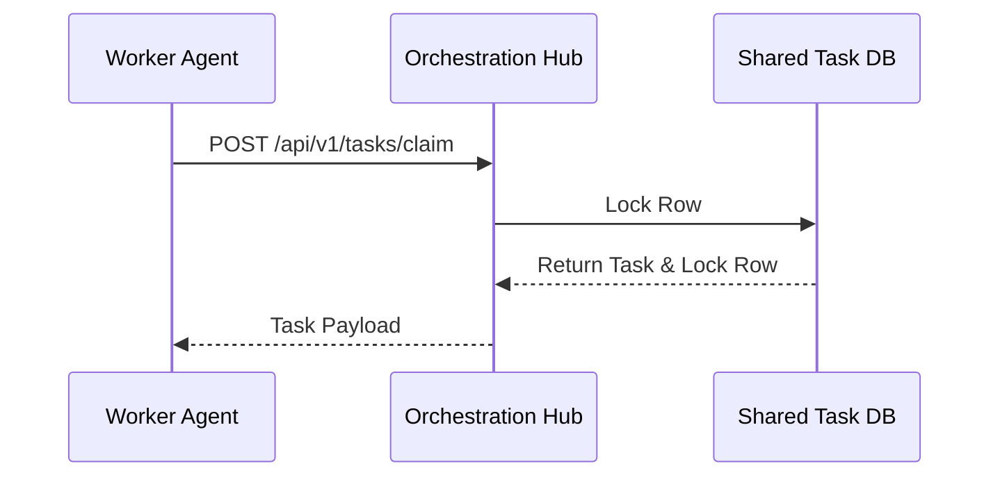
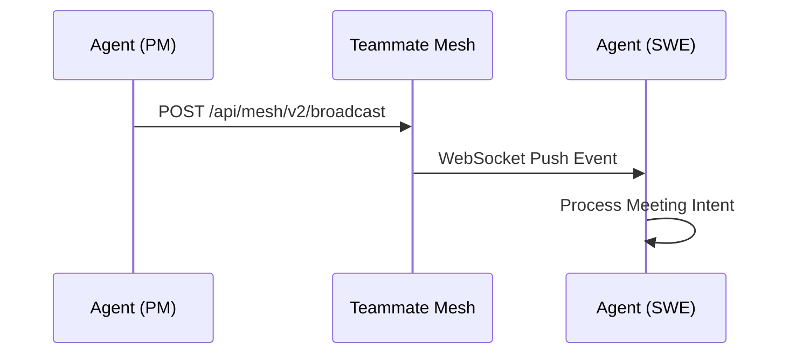
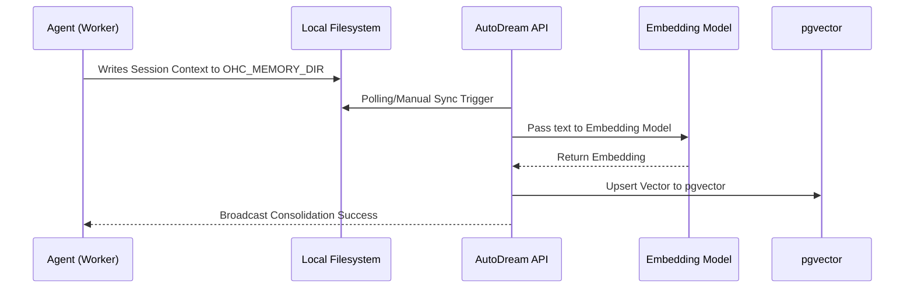
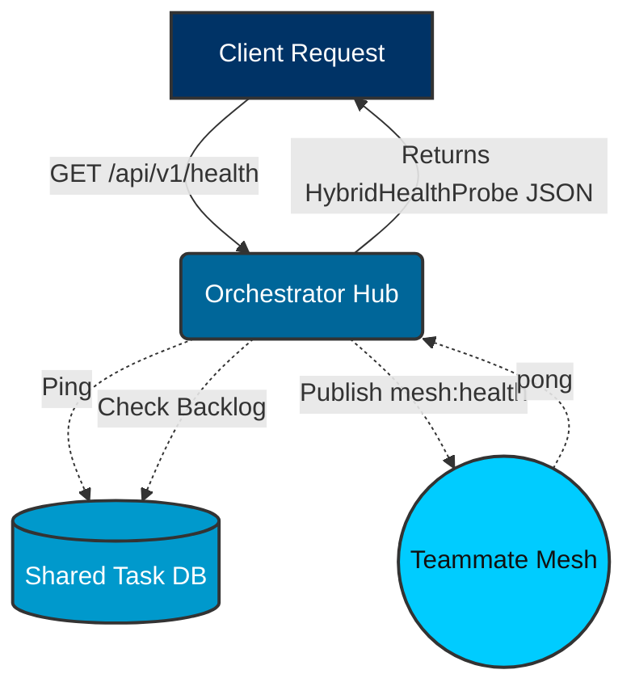

# API Playbook Visual Walkthroughs

Welcome to the Visual Walkthrough of the One Human Corp (OHC) API. This guide provides interactive flowcharts and sequences illustrating the core KAIROS Orchestration pathways, designed with the OHC premium aesthetic.

## 1. KAIROS Shared Task Claiming

The distributed state machine allows sub-agents to claim pending tasks safely.

## 2. Teammate Mesh Virtual Room Broadcasting

Agents coordinate and resolve the Swarm Intelligence Protocol (OHC-SIP) by publishing intent broadcasts into Virtual Rooms.

## 3. AutoDream Vector Consolidation

The AutoDream pipeline condenses short-term memory fragments into long-term pgvector embeddings.

## 4. Hybrid Health Probes

Health probes ensure system stability across cloud and standalone operating modes.

