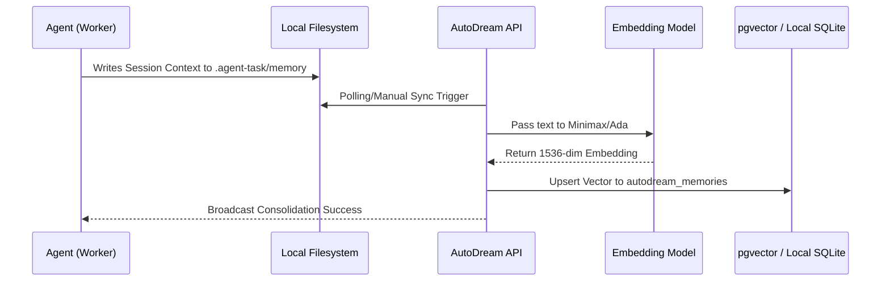

<div markdown="1" style="backdrop-filter: blur(15px); font-family: 'Outfit', 'Inter', sans-serif; border: 1px solid rgba(255, 255, 255, 0.1); padding: 20px; border-radius: 12px; background: rgba(255, 255, 255, 0.03); color: #fff;">

# AutoDream Pipeline: Visual Walkthrough

This guide details the architectural flow of the AutoDream Pipeline, the powerful memory consolidation system that converts short-term agent context into long-term vector embeddings.

## 1. Overview of the AutoDream Pipeline

The AutoDream Pipeline is responsible for processing episodic memories (such as task transcripts, deliberation notes, and code summaries) and consolidating them into a unified vector database for long-term Retrieval-Augmented Generation (RAG).

### Memory Consolidation Workflow



## 2. Hybrid Mode Execution

The AutoDream Pipeline is designed to operate seamlessly across the OHC Hybrid Architecture (OHC-HA), adapting to the available infrastructure while maintaining data sovereignty.

### Architecture Comparison

```mermaid
graph TD
    subgraph Cloud Native Mode
        A1[Agent Memory] -->|Ingest| W1[AutoDream Worker]
        W1 -->|Embed via API| L1[Cloud LLM]
        W1 -->|Upsert Vector| V1[(PostgreSQL + pgvector)]
        V1 -->|RAG Query| C1[Swarm Context]
    end

    subgraph Standalone Mode
        A2[Agent Memory] -->|Ingest| W2[Local Daemon]
        W2 -->|Embed via Local LLM| L2[Local Embedding Model]
        W2 -->|Upsert Vector| V2[(SQLite Vector Extension)]
        V2 -->|RAG Query| C2[Local Context]
    end

    classDef premium fill:rgba(255,255,255,0.03),stroke:rgba(255,255,255,0.08),stroke-width:1px,color:#fff,backdrop-filter:blur(15px);
    class A1,W1,L1,V1,C1,A2,W2,L2,V2,C2 premium;
```

## 3. Best Practices

- **Frequent Context Flushing**: Agents should write out their intermediate reasoning and crucial findings to `.agent-task/memory` frequently to ensure the pipeline captures granular insights.
- **Data Privacy via Standalone Mode**: When working with highly sensitive intellectual property, utilize Standalone Mode to ensure embeddings are generated locally and stored exclusively in the SQLite database without exfiltrating data to the cloud.

</div>
