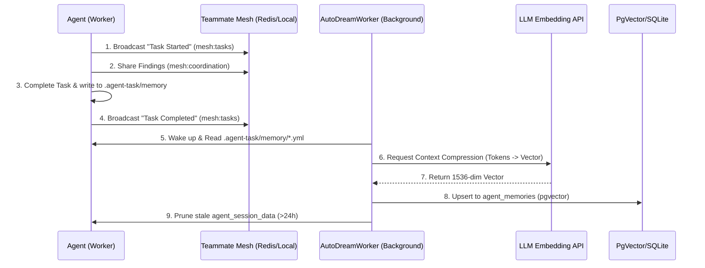

# AutoDream Data Pipeline Walkthrough

Welcome to the interactive walkthrough for the **AutoDream Data Pipeline**, the core component of the KAIROS Orchestrator that powers long-term memory consolidation for the OHC Swarm.

## 1. Why AutoDream?

Agents generate massive amounts of ephemeral data during task execution. Without a mechanism to distill this information, agent context windows would quickly overflow. AutoDream prevents this by continuously sweeping session data and consolidating it into durable vector embeddings.

## 2. Memory Consolidation Workflow

The AutoDream pipeline operates asynchronously to ensure it never blocks primary agent execution. It follows a rigorous sequence to convert raw text into highly queryable vectors.

## 3. Storage Adapters

AutoDream is built for the OHC Hybrid Architecture (OHC-HA) and adapts its storage engine automatically:

- **Cloud-Native Mode:** Uses **PostgreSQL with the `pgvector` extension** for Exact Nearest Neighbor search across multi-tenant data on 1536-dimensional embeddings.
- **Standalone Mode:** Degrades gracefully to **SQLite**.

For a deeper look into the exact schema and locking mechanisms, check out the [AutoDream Feature Guide](../features/kairos/autodream_pipeline.md).

