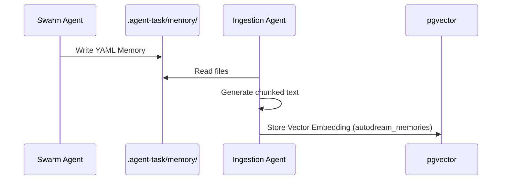

# AutoDream Pipeline Walkthrough

Welcome to the AutoDream Pipeline walkthrough. This document outlines the long-term memory system of the OHC Swarm.

## 1. Overview
The AutoDream background pipeline asynchronously vectorizes ephemeral findings into a durable pgvector store. This prevents context window overflows and ensures long-term coherence across the swarm.

## 2. Data Pipeline Architecture
1. **Source**: Local `.agent-task/memory/` YAML files.
2. **Ingestion Agent**: Reads files, generates chunked text.
3. **Embedding Generation**: Calls LLM provider (e.g., Anthropic/OpenAI/Minimax) to produce vectors.
4. **Storage (pgvector)**:
   - Data is stored in the `autodream_memories` table.

