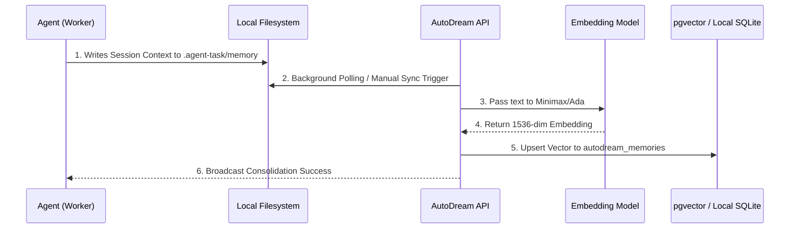

<div markdown="1" style="backdrop-filter: blur(20px) saturate(200%); font-family: 'Outfit', 'Inter', sans-serif; border: 1px solid rgba(255, 255, 255, 0.1); padding: 20px; border-radius: 12px; background: rgba(255, 255, 255, 0.05); color: #fff;">

# AutoDream Pipeline Visual Walkthrough

The **AutoDream Pipeline** is the core memory consolidation engine of the One Human Corp (OHC) Swarm, converting episodic agent memories into a searchable, long-term semantic vector database.

## 1. What is AutoDream?

During active execution, agents document their findings, tool usages, and task contexts in local YAML files within the `.agent-task/memory/` directory. While this is efficient for short-term episodic memory and zero-WIP state persistence, it doesn't scale for complex contextual queries.

AutoDream solves this by continuously running as a background pipeline that:
1. Parses these localized episodic memory files.
2. Compresses the context to maximize token efficiency.
3. Generates 1536-dimensional embeddings (via Minimax or OpenAI).
4. Persists the generated vectors to `pgvector` (Cloud) or `sqlite-vss` (Standalone).

## 2. Pipeline Architecture

Below is the workflow showing how raw agent context is transformed into retrievable intelligence via the AutoDream pipeline:



## 3. Storage Backends (Hybrid Approach)

The OHC-HA architecture ensures memory is never siloed.

- **Cloud-Native Mode:** Uses `pgvector` inside PostgreSQL for scalable, high-concurrency exact nearest neighbor queries.
- **Standalone Mode:** Uses SQLite to store embeddings locally.

Both backends share the same abstract RAG interface, meaning agents query context uniformly regardless of the underlying environment.

### Vector Retrieval Flow
When a new agent is provisioned and needs historical context, it performs a RAG query:

```mermaid
graph TD
    Agent[Newly Provisioned Agent] -->|Queries Context| API[KAIROS Orchestration API]
    API -->|RAG Nearest Neighbor Search| DB[(pgvector / SQLite)]
    DB -->|Returns top-K Matches| API
    API -->|Injects Context| Agent

    classDef premium fill:rgba(255,255,255,0.03),stroke:rgba(255,255,255,0.08),stroke-width:1px,color:#fff,backdrop-filter:blur(20px) saturate(200%);
    class Agent,API,DB premium;
```

## 4. Triggering AutoDream

While AutoDream typically runs passively in the background, you can manually force an immediate sync for testing or critical state persistence via the REST API:

```bash
curl -X POST https://api.ohc.local/v1/autodream/sync \
  -H "Authorization: Bearer <JWT>" \
  -H "Content-Type: application/json" \
  -d '{"force_reindex": false}'
```

*(See the [API Playbook](../api/playbook.md) for full interactive API details.)*

</div>
