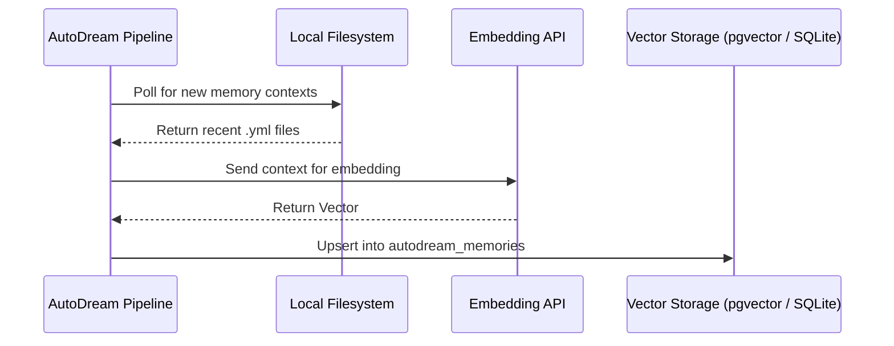

<div markdown="1" style="backdrop-filter: blur(20px) saturate(200%); font-family: 'Outfit', 'Inter', sans-serif; border: 1px solid rgba(255, 255, 255, 0.1); padding: 20px; border-radius: 12px; background: rgba(255, 255, 255, 0.05); color: #fff;">

# AutoDream Data Pipelines: Visual Walkthrough

This guide details the architectural flow of the AutoDream Data Pipelines, the long-term memory consolidation engine of the KAIROS Orchestrator.

## 1. Overview of AutoDream

AutoDream is responsible for translating ephemeral agent session contexts into durable vector embeddings, preventing context window overflow and enabling exact semantic search across the swarm.

### Storage Engine Fallback

```mermaid
graph TD
    subgraph Cloud Native Mode
        A1[AutoDream Pipeline] -->|Embed| C1[Embedding Model]
        C1 -->|1536-dim Vector| P1[(PostgreSQL: pgvector)]
        P1 -->|Exact Nearest Neighbor| S1[Semantic Search]
    end

    subgraph Standalone Mode
        A2[AutoDream Pipeline] -->|Embed| C2[Local LLM / JSON Fallback]
        C2 -->|Text Blobs| P2[(SQLite Local DB)]
        P2 -->|Recency / Basic Search| S2[Semantic Search]
    end

    classDef premium fill:rgba(255,255,255,0.03),stroke:rgba(255,255,255,0.08),stroke-width:1px,color:#fff,backdrop-filter:blur(20px) saturate(200%);
    class A1,C1,P1,S1,A2,C2,P2,S2 premium;
```

## 2. Pipeline Execution Flow

1. **Extraction**: The AutoDream pipeline periodically polls for new `.agent-task/memory/*.yml` files.
2. **Embedding**: The context is chunked, tokenized, and sent to the embedding model.
3. **Consolidation**: The generated vectors are upserted into the `autodream_memories` table.



## 3. Implementation and Scalability

- **Graceful Degradation**: AutoDream handles fallback from Postgres-specific features when in Standalone Mode, accommodating SQLite limits.
- **Observability**: Metrics on processed memories are pushed to OpenTelemetry.

</div>
