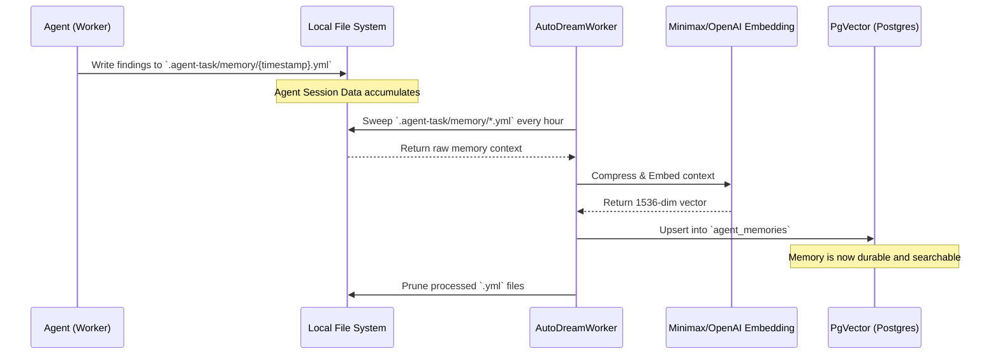

<div markdown="1" style="backdrop-filter: blur(20px) saturate(200%); font-family: 'Outfit', 'Inter', sans-serif; border: 1px solid rgba(255, 255, 255, 0.1); padding: 20px; border-radius: 12px; background: rgba(255, 255, 255, 0.05); color: #fff;">

# 🧠 AutoDream Sync Engine: Visual Walkthrough

Welcome to the AutoDream Sync Engine walkthrough. This guide illustrates how One Human Corp (OHC) agents automatically consolidate their fragmented session states and task findings into durable long-term memory via the `AutoDreamWorker`.

## 1. What is AutoDream?

When operating autonomously, agents generate a massive amount of context. In Standalone Mode, this context is stored locally in YAML format inside `.agent-task/memory/`.

The **AutoDream Sync Engine** is a background pipeline that:
1. Periodically sweeps the local memory directory.
2. Extracts and synthesizes findings using a Large Language Model (LLM).
3. Embeds the synthesized memory into high-dimensional vectors (e.g., using pgvector).
4. Persists the vectors into the global `agent_memories` table for future retrieval.

## 2. AutoDream Pipeline Architecture

The flow from local execution to long-term memory is entirely automated and seamless.



## 3. Retrieving Memories

Once an insight is consolidated by AutoDream, any agent in the Swarm can retrieve it during future task execution. This is critical for the `UltraPlan` deliberation process.

```mermaid
graph TD
    Query[New Task: Refactor API] --> Orchestrator[KAIROS Orchestrator]
    Orchestrator --> |Query| VectorDB[(PgVector Database)]
    VectorDB --> |Cosine Similarity Search| Insight[Insight: Previous API changes]
    Insight --> Agent[Assigned SWE Agent]
    Agent --> |Executes with Full Context| Solution[Code Changes]

    classDef premium fill:rgba(255,255,255,0.03),stroke:rgba(255,255,255,0.08),stroke-width:1px,color:#fff,backdrop-filter:blur(20px) saturate(200%);
    class Query,Orchestrator,VectorDB,Insight,Agent,Solution premium;
```

## 4. Key Benefits

- **Zero Data Loss:** Even in Standalone mode offline, insights are safely stored and synced later.
- **Swarm Intelligence:** When one agent learns a new architectural pattern, the entire swarm benefits immediately upon consolidation.
- **Cost Efficiency:** By compressing raw logs into dense embeddings, we minimize LLM token usage during subsequent queries.

*For more information on the overarching OHC orchestration, refer to the [Teammate Mesh Walkthrough](teammate_mesh.md).*

</div>