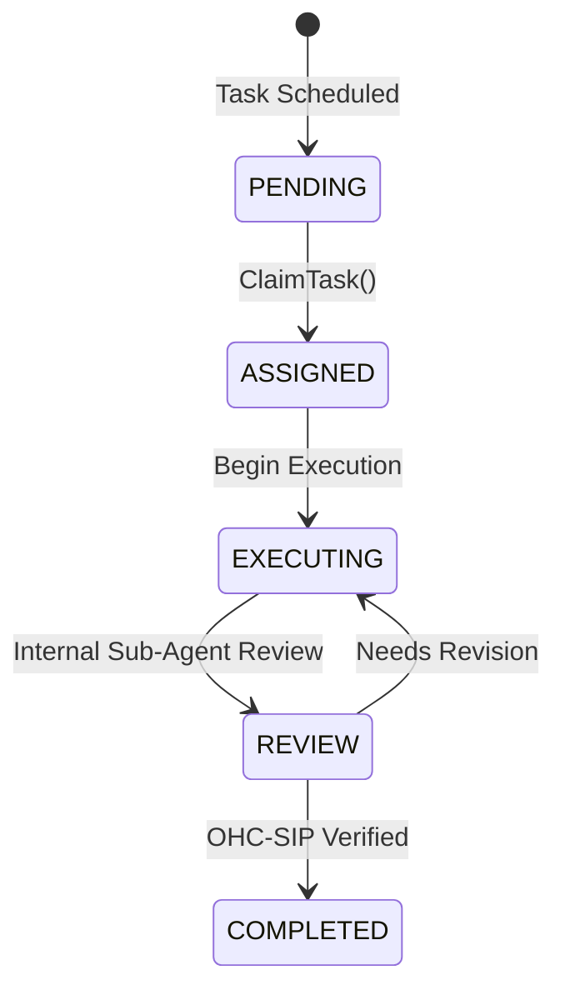

# OHC Distributed State Machine: Visual Walkthrough

Welcome to the walkthrough for the KAIROS Orchestrator's Distributed State Machine. This module ensures flawless execution tracking across the Swarm.

## Core Flow & Concurrency

Whether deployed in Cloud-Native Mode (PostgreSQL) or Standalone Desktop Mode (SQLite), task assignment must be conflict-free.
- **Cloud Mode:** Utilizes robust row-level locking via `FOR UPDATE SKIP LOCKED`.
- **Standalone Mode:** Employs application-level mutexes and SQLite table isolation.

## State Transitions

Agents dynamically pick up tasks and transition them through an immutable execution lifecycle:

