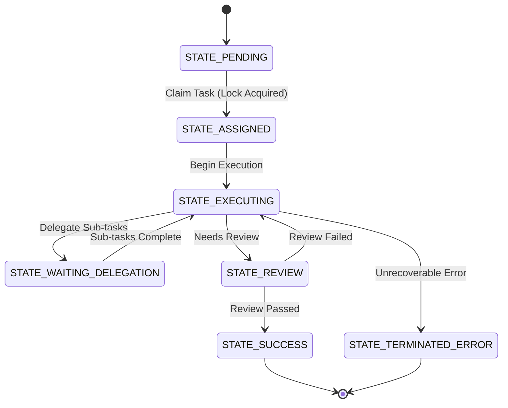

# Distributed State Machine: Visual Walkthrough

The Distributed State Machine is a core KAIROS Orchestration component that ensures resilient multi-agent task execution across Cloud-Native (Postgres/Redis) and Standalone (SQLite) architectures.

## Execution Flow

## Resilience and distributed locking

- **Cloud Mode:** Uses Redis `SET NX EX` or Postgres `FOR UPDATE SKIP LOCKED` for high-concurrency lock arbitration.
- **Standalone Mode:** Uses SQLite application-level mutexes for local host efficiency.

