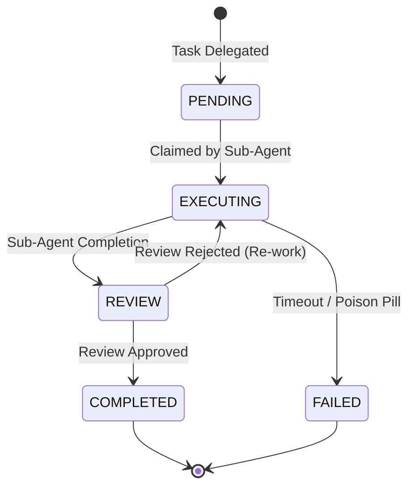

<div markdown="1" style="backdrop-filter: blur(20px) saturate(200%); font-family: 'Outfit', 'Inter', sans-serif; border: 1px solid rgba(255, 255, 255, 0.1); padding: 20px; border-radius: 12px; background: rgba(255, 255, 255, 0.03); color: #fff;">

# Distributed State Machine: Visual Walkthrough

This guide details the architectural flow of the KAIROS Distributed State Machine, the core backbone ensuring predictable and deadlock-free agent state transitions across both Cloud-Native and Standalone deployments.

## 1. Overview of Distributed State Transitions

When the One Human Corp (OHC) Swarm executes a complex DAG (Directed Acyclic Graph) of tasks, it is critical that no two agents attempt to execute the same dependency concurrently. The Distributed State Machine tracks transitions (`PENDING` → `EXECUTING` → `REVIEW` → `COMPLETED`) globally.

### Hybrid Architecture Locking Mechanisms

```mermaid
graph TD
    subgraph Cloud Native Mode
        A1[Agent Worker] -->|Request Transition| API1[KAIROS Orchestrator]
        API1 -->|Acquire Lock| L1[Redis Distributed Lock]
        L1 -->|Update State| PG1[(PostgreSQL FOR UPDATE SKIP LOCKED)]
    end

    subgraph Standalone Mode
        A2[Agent Worker] -->|Request Transition| API2[KAIROS Orchestrator]
        API2 -->|Acquire Mutex| L2[sync.Mutex / Local Semaphore]
        L2 -->|Update State| SQ2[(SQLite Local Transaction)]
    end

    classDef premium fill:rgba(255,255,255,0.03),stroke:rgba(255,255,255,0.08),stroke-width:1px,color:#fff,backdrop-filter:blur(20px) saturate(200%);
    class A1,API1,L1,PG1,A2,API2,L2,SQ2 premium;
```

## 2. Standard Task State Machine Flow

The `state_machine_transitions` table acts as an append-only ledger of state changes, ensuring an auditable history of the swarm's orchestration.



## 3. Implementation Flow

1. **State Assertion**: Agents propose a state transition (e.g., "I am moving Task A from `PENDING` to `EXECUTING`").
2. **Lock Acquisition**:
   - In Cloud Mode: `SET NX EX` via Redis protects the orchestration barrier, followed by a PostgreSQL `FOR UPDATE SKIP LOCKED` query.
   - In Standalone Mode: Go's `sync.Mutex` (`to.mu.Lock()`) prevents concurrent SQLite parsing panics.
3. **Commit Ledger**: A new record is inserted into `state_machine_transitions`.
4. **Mesh Broadcast**: The state change is broadcasted across the Teammate Mesh (`mesh:tasks` channel) so the UI and other agents are updated in real-time.

</div>
