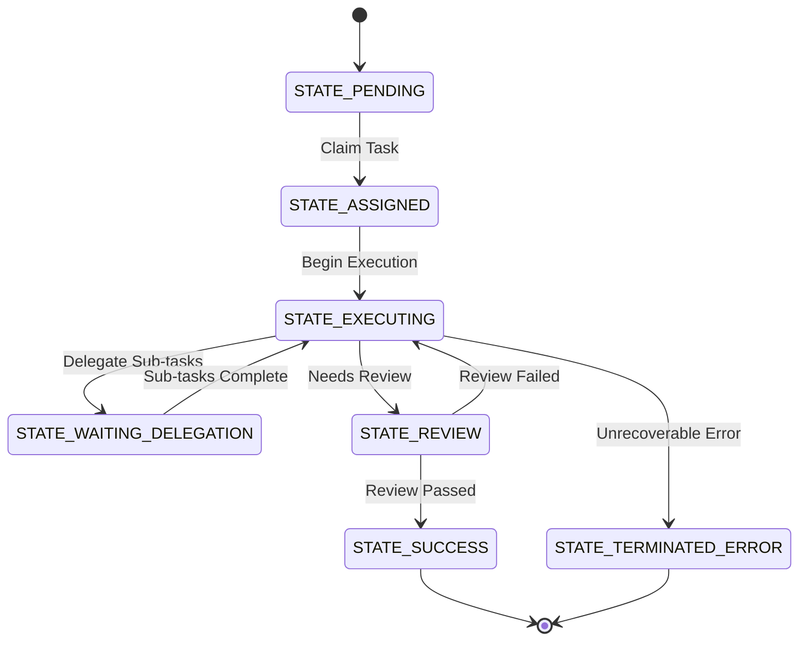

<div markdown="1" style="backdrop-filter: blur(20px) saturate(200%); font-family: 'Outfit', 'Inter', sans-serif; border: 1px solid rgba(255, 255, 255, 0.1); padding: 20px; border-radius: 12px; background: rgba(255, 255, 255, 0.05); color: #fff;">

# Distributed State Machine: Visual Walkthrough

This guide details the Distributed State Machine Tracker, a core pillar of the KAIROS Orchestration engine that provides a resilient mechanism to track and transition agent coordination states securely.

## 1. Transition Lifecycle

The state machine enforces deterministic transitions, ensuring that if a worker node crashes mid-task, the DAG dependencies do not permanently stall.



## 2. Lock Mechanics

To survive worker pod failures and prevent race conditions, distributed locks are employed:

- **Cloud Mode:** `rueidis` sets an exclusive lock using `SET NX EX`.
- **Standalone Mode:** Uses Postgres `FOR UPDATE` or SQLite transaction locks.

```mermaid
graph TD
    A[Agent] -->|Request Transition| B{Mode}
    B -->|Cloud| C[(Redis rueidis SET NX EX)]
    B -->|Standalone| D[(SQLite DB Lock)]
    C --> E[Update state_machine_transitions]
    D --> E
    E --> F[Broadcast Teammate Mesh Event]

    classDef premium fill:rgba(255,255,255,0.03),stroke:rgba(255,255,255,0.08),stroke-width:1px,color:#fff,backdrop-filter:blur(20px) saturate(200%);
    class A,B,C,D,E,F premium;
```

</div>
