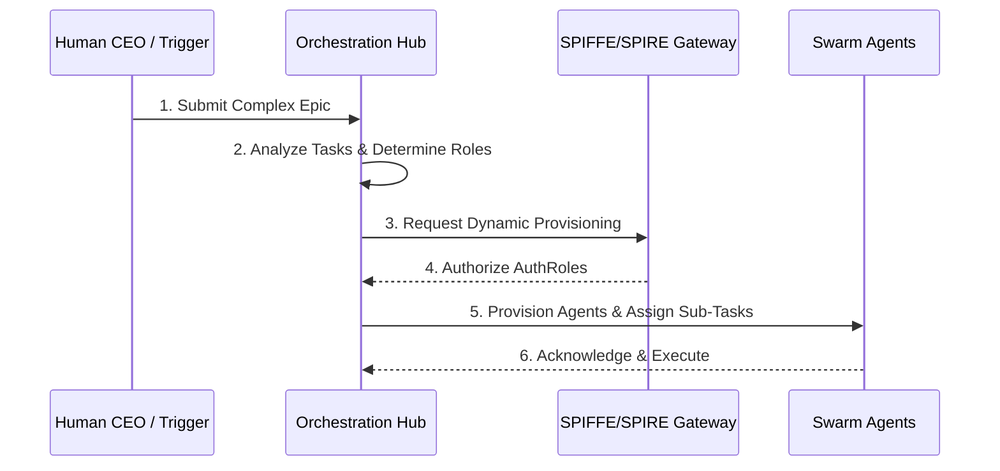

<div markdown="1" style="backdrop-filter: blur(20px) saturate(200%); font-family: 'Outfit', 'Inter', sans-serif; border: 1px solid rgba(255, 255, 255, 0.1); padding: 20px; border-radius: 12px; background: rgba(255, 255, 255, 0.05); color: #fff;">

# Dynamic Team Assembly: Visual Walkthrough

Welcome to the Dynamic Team Assembly guide. This walkthrough explains how the KAIROS Orchestrator dynamically provisions a bespoke team of specialized agents to handle complex workflows and epics.

## 1. Dynamic Team Orchestration Flow

When a complex Epic is ingested, the Manager Agent analyzes the requirements and provisions a team with the necessary roles, dynamically scaling replicas to ensure zero latency and adherence to SLA metrics.



## 2. Resource Exhaustion and Auto-Recovery

To guarantee performance, the system actively monitors the dynamically assembled team. If context bloat occurs, the orchestrator triggers context summarization and scales operations.

```mermaid
graph TD
    Monitor[Telemetry Monitor] -->|Detects Token Bloat| Orchestrator[Orchestration Hub]
    Orchestrator --> Action{Mitigation Action}
    Action -->|Summarize| Summarize[Context Summarization]
    Action -->|Scale Down| RateLimit[Rate Limit / Scale Replicas]
    Summarize --> DB[(Vector DB)]

    classDef premium fill:rgba(255,255,255,0.03),stroke:rgba(255,255,255,0.08),stroke-width:1px,color:#fff,backdrop-filter:blur(20px) saturate(200%);
    class Monitor,Orchestrator,Action,Summarize,RateLimit,DB premium;
```

</div>
