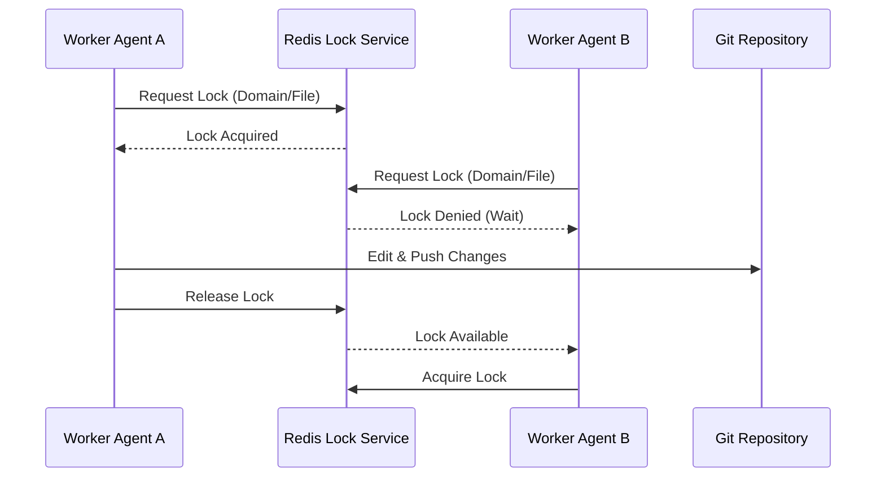

# Distributed Git-Lock Coordination Walkthrough

Welcome to the visual walkthrough for Git-Lock Coordination in the OHC Hybrid Agentic OS. This process is critical for preventing merge conflicts when multiple Swarm Agents modify shared files concurrently.

## 1. The Git-Lock State Machine

Before modifying files, agents must check production distributed Redis locks. If the lock is held by another agent, they must wait.

## 2. Best Practices

- **Check Mailbox**: Always coordinate via production Redis Pub/Sub channels.
- **Domain Scope**: Ensure modifications are strictly scoped to your assigned domain directory.
- **Graceful Wait**: Implement exponential backoff if a lock is currently held.

