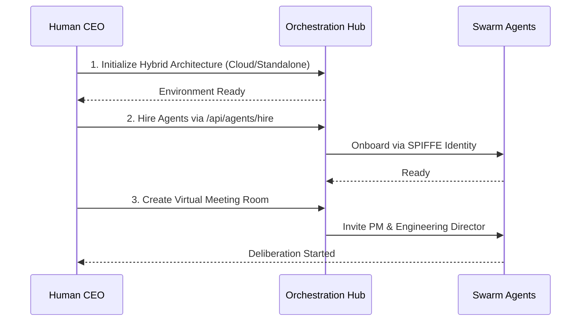

<div markdown="1" style="backdrop-filter: blur(20px) saturate(200%); font-family: 'Outfit', 'Inter', sans-serif; border: 1px solid rgba(255, 255, 255, 0.1); padding: 20px; border-radius: 12px; background: rgba(255, 255, 255, 0.05); color: #fff;">

# OHC Help Portal: Visual Walkthroughs

Welcome to the One Human Corp Help Portal. This guide will walk you through setting up and orchestrating your swarm of agents seamlessly across the Hybrid Architecture.

## 1. Getting Started Flow

Follow these steps to unleash the power of the OHC Swarm:



### Step-by-Step Instructions

1. **Initialize the Orchestration Hub**
   Start by configuring your base environment. The system operates on the `OHC-HA` (Hybrid Architecture). Use the setup CLI (`ohc_hybrid_cli.sh`) or manually configure your `.env` to select between Cloud, Headless, or Standalone modes.

2. **Hiring Agents**
   Use the UI dashboard or the API to assemble your team. Agents are automatically onboarded using zero-trust SPIFFE identity protocols, ensuring secure communication and delegation.

3. **Virtual Meeting Rooms**
   Initiate a session by inviting the PM and Engineering Director agents to a Virtual Meeting Room. They will use the UltraPlan protocol to debate the scope before executing any code.

## 2. Interactive Agent Status Dashboard

Keep track of your swarm via the Teammate Mesh realtime updates. The dashboard uses Centrifuge (`mesh:tasks`) to reflect the exact status of your delegation hierarchy.

```mermaid
graph LR
    Task[Task: Build Feature] --> |Delegated| Director[Engineering Director]
    Director --> |Sub-Task| SWE[Software Engineer]
    Director --> |Sub-Task| QA[QA Tester]

    classDef premium fill:rgba(255,255,255,0.03),stroke:rgba(255,255,255,0.08),stroke-width:1px,color:#fff,backdrop-filter:blur(20px) saturate(200%);
    class Task,Director,SWE,QA premium;
```

## 3. Troubleshooting

- **Redis Connections in Standalone Mode**: In Standalone mode, OHC falls back gracefully to SQLite. Ensure your `DATABASE_URL` is configured for your local sqlite database rather than a remote Postgres instance.
- **Teammate Mesh Not Syncing**: Verify the connection to the Centrifuge realtime pub/sub system and ensure your client is subscribed to the `mesh:tasks` channels. Check the network logs for any 401 Unauthorized errors indicating token expiration.

*For more advanced topics, API references, and payload examples, see the [API Playbook](../api/playbook.md). For an overview of modes, see the [Architecture Walkthrough](architecture.md).*

</div>
