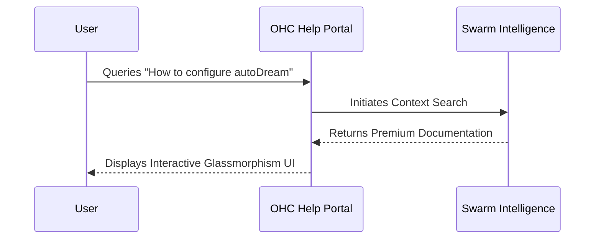

# Interactive Help Portal Walkthrough

## Overview
This visual guide provides a walkthrough of the Interactive Help Portal features, showing how users can orchestrate Swarm Intelligence.

## Help Portal Resolution Flow

## Key Portals
- `ohc://help/home`: Main Portal
- `ohc://help/search`: Interactive Search

