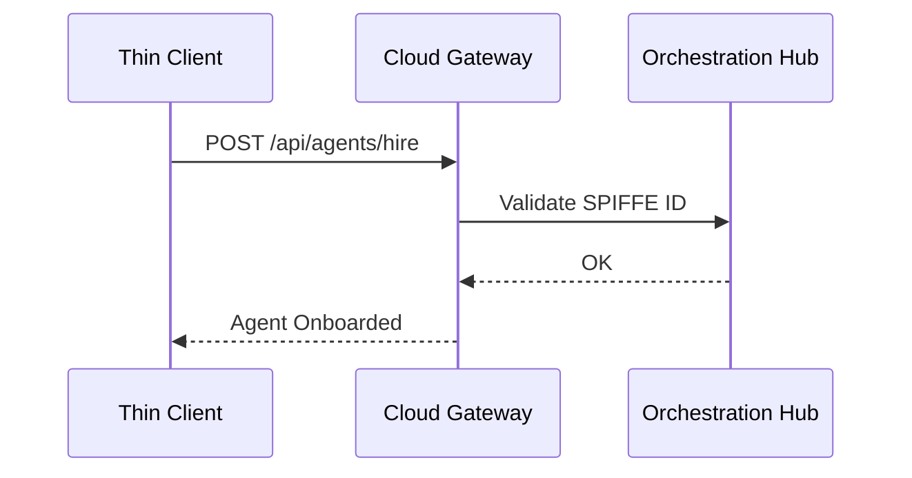

# Hybrid Agentic OS API Walkthrough

Welcome to the Hybrid Agentic OS interactive API walkthrough. This document outlines how thin clients, standalone desktops, and cloud hubs communicate securely via the API.

## API Routing Flow

## Key Orchestration Endpoints
- `POST /api/agents/hire`: Onboard agents via SPIFFE Identity.
- `GET /api/v1/health`: Hybrid health probe endpoint to determine operating mode.
- `POST /api/queue/subagent`: Enqueue autonomous sub-tasks dynamically.

