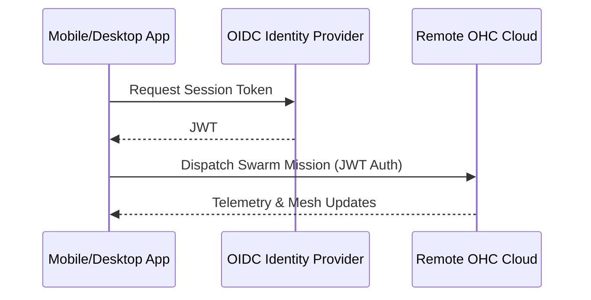

<div markdown="1" style="backdrop-filter: blur(20px) saturate(200%); font-family: 'Outfit', 'Inter', sans-serif; border: 1px solid rgba(255, 255, 255, 0.1); padding: 20px; border-radius: 12px; background: rgba(255, 255, 255, 0.05); color: #fff;">

# OHC Hybrid Architecture Modes Walkthrough

Welcome to the **OHC Hybrid Architecture Modes Walkthrough**. This document outlines the three primary operational states of the One Human Corp Swarm and how they interact seamlessly to deliver optimal performance and autonomy.

## 1. Cloud-Native Mode

The **Cloud-Native Mode** is the multi-tenant, enterprise-grade state, orchestrated by Kubernetes. It uses powerful, stateful backend services to handle extreme concurrency.

- **Primary DB:** PostgreSQL
- **Vector DB:** pgvector
- **Cache/Queue:** Redis

```mermaid
graph TD
    User[Human User] -->|Web/API| LoadBalancer[K8s Ingress]
    LoadBalancer --> ApiServer[KAIROS API Server]
    ApiServer --> DB[(PostgreSQL)]
    ApiServer --> Redis[(Redis Mesh)]
    ApiServer --> Vector[(pgvector)]

    classDef premium fill:rgba(255,255,255,0.03),stroke:rgba(255,255,255,0.08),stroke-width:1px,color:#fff,backdrop-filter:blur(20px) saturate(200%);
    class User,LoadBalancer,ApiServer,DB,Redis,Vector premium;
```

## 2. Standalone Desktop Mode

The **Standalone Desktop Mode** is a localized, privacy-first implementation where the swarm runs completely isolated on a single machine. It gracefully degrades its components to run effectively without complex infrastructure.

- **Primary DB:** SQLite
- **Vector DB:** SQLite (In-Memory JSON Fallback / AutoDream Local)
- **Cache/Queue:** Go Channels

```mermaid
graph TD
    User[Human User] -->|Local Execution| CLI[CLI / Desktop App]
    CLI --> LocalAgent[Standalone KAIROS Core]
    LocalAgent --> SQLite[(SQLite DB)]
    LocalAgent --> Channels[Go In-Memory Queue]

    classDef premium fill:rgba(255,255,255,0.03),stroke:rgba(255,255,255,0.08),stroke-width:1px,color:#fff,backdrop-filter:blur(20px) saturate(200%);
    class User,CLI,LocalAgent,SQLite,Channels premium;
```

## 3. Thin Client Mode

The **Thin Client Mode** provides pure UI accessibility over Mobile or Desktop interfaces, passing execution workload entirely to a configured remote OHC API. The focus here is on robust authentication and low-latency interaction.



## 4. Mode Synchronization (Hybrid-RAG)

When a user switches from Standalone to Cloud-Native, the Hybrid Sync MCP pushes locally stored SQLite episodic memories to the Cloud PostgreSQL pgvector database to ensure global swarm knowledge consistency.

*For instructions on how to switch modes locally, consult the [Help Portal](help_portal.md).*

</div>
