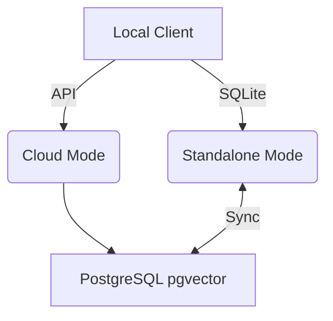

# Hybrid MCP Architecture Walkthrough

Welcome to the OHC Hybrid Model Context Protocol (MCP) Architecture visual walkthrough. This guide explains how OHC bridges local offline execution with multi-tenant cloud scaling.

## Core Concepts

| Architecture Mode | Data Storage | Scaling |
| --- | --- | --- |
| **Cloud-Native** | PostgreSQL (pgvector), Redis | Infinite / K8s |
| **Standalone** | SQLite (Local) | Low Resource |

## Workflow Diagram

## Setup Instructions
1. Ensure your OHC client is configured for the desired mode.
2. Refer to the [API Playbook](../api_playbook.md) for endpoint details.
3. Verify connection stability.

