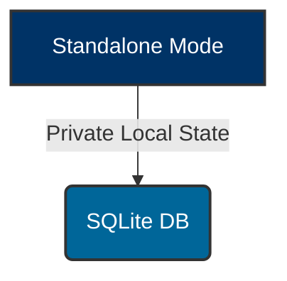
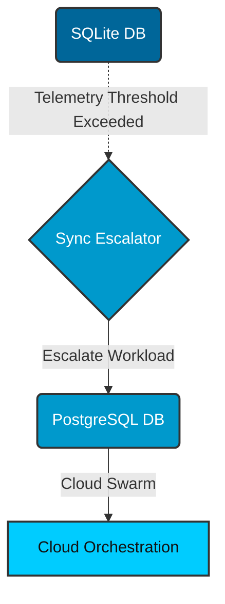

# Hybrid MCP RAG Dynamic Escalation: Visual Walkthrough

This guide details the architectural flow of the Dynamic Cloud Escalation for Hybrid MCP RAG, which bridges Standalone SQLite and Cloud PostgreSQL orchestration when massive parallel computation is required.

## 1. Local Default Execution

By default, MCP RAG workloads execute locally, ensuring absolute privacy.

## 2. Dynamic Escalation Flow

When telemetry thresholds indicate massive parallel computation or swarm consensus is needed, the `Sync Escalator` daemon seamlessly hands off tasks to the K8s Cloud Swarm.

