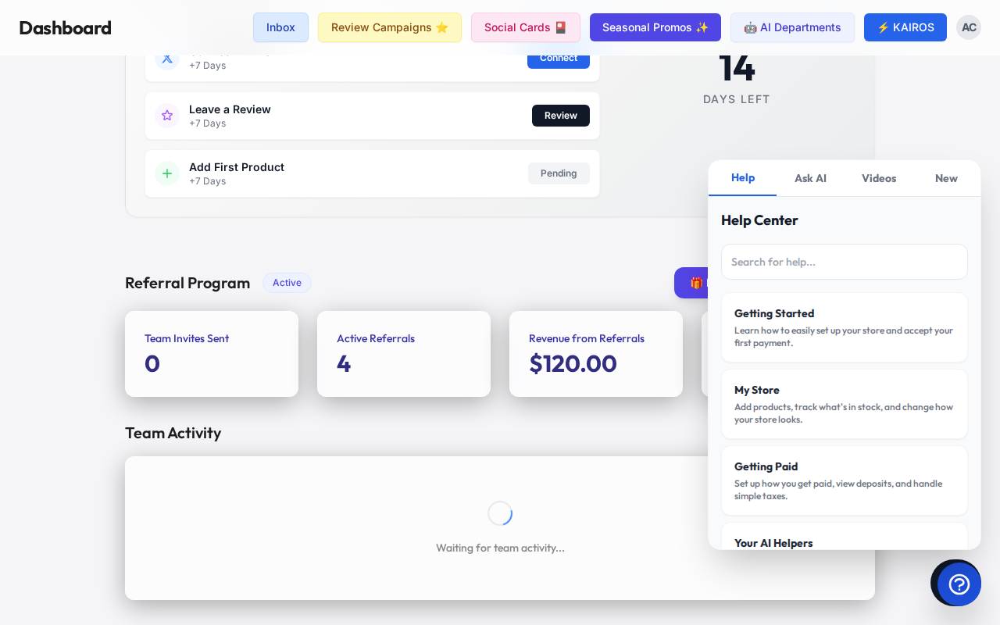
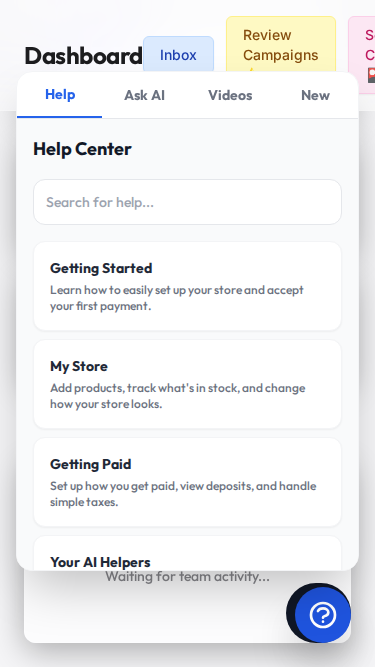

# Hybrid MCP RAG Protocol Visual Walkthrough

Welcome to the visual walkthrough for our new smart search feature (we call it the Hybrid MCP RAG Protocol). Think of it as a super-smart filing cabinet for your business that works lightning fast, even if your internet goes down!

## How It Helps Your Business

As a busy business owner, you don't have time to dig through old files. This tool helps you:

* **Find Answers Instantly:** Ask a question, and it searches all your business documents (like recipes, manuals, or past quotes) to give you the exact answer.
* **Work Offline:** Whether you are in a basement without cell service or a food truck with spotty Wi-Fi, you can still find your important notes.
* **Keep Data Safe:** Your business secrets stay with you. It works locally so your private info never leaks.

## Visual Guide

Here is what it looks like when you search for something:



*On your computer, you will see a clear search bar at the top.*



*On your phone, it is easy to use with just your thumb.*

## Interactive API Documentation

If you have a developer helping you, they can connect your other tools using our simple API.

### Search Your Documents

You can send a request to search your files like this:

```json
POST /api/v1/search
{
  "query": "What is the recipe for the vanilla cake?",
  "offline_mode": true
}
```

### Add a New Document

You can also save a new file into your smart filing cabinet:

```json
POST /api/v1/documents
{
  "title": "Vanilla Cake Recipe",
  "content": "Mix flour, sugar, and vanilla extract..."
}
```

We hope this helps you run your business more smoothly! If you have any questions, our support team is always ready to help.
