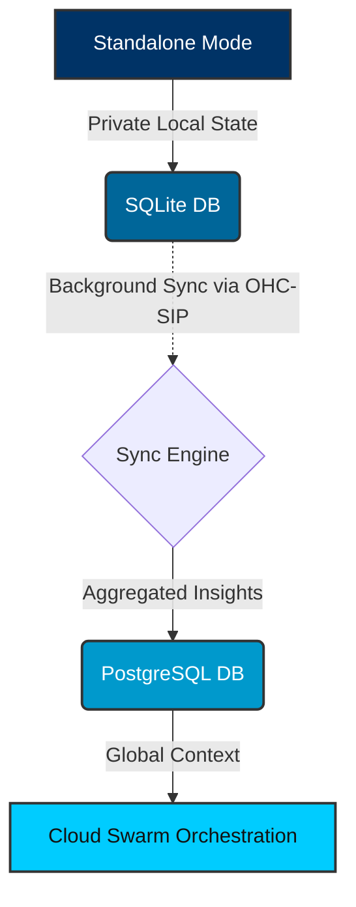

# Hybrid MCP RAG Protocol Walkthrough

Welcome to the walkthrough for the **Hybrid MCP RAG Protocol**. This mechanism seamlessly synchronizes Standalone SQLite offline memory states with the massive multi-tenant Cloud PostgreSQL orchestration database, ensuring persistent Swarm Intelligence.

## 1. Architectural Overview

## 2. Sync Lifecycle

  <strong>Data Extraction & Queueing</strong>
  
Local Standalone Agents extract insights and record them into the local SQLite `rag_memories` table with `sync_status = 'pending'`. The Lightweight Go Daemon periodically checks this queue.

  <strong>Secure Cloud Escrow</strong>
  
The payload is TLS-encrypted and securely shipped to the Cloud API Gateway. Once the Postgres layer processes the vectors using `pgvector`, the Standalone client receives a confirmation, updating the record to `sync_status = 'synced'`.

