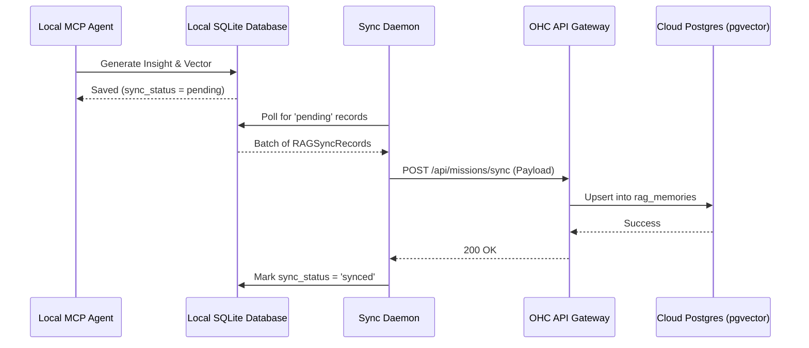

<div markdown="1" style="backdrop-filter: blur(20px) saturate(200%); font-family: 'Outfit', 'Inter', sans-serif; border: 1px solid rgba(255, 255, 255, 0.1); padding: 20px; border-radius: 12px; background: rgba(255, 255, 255, 0.05); color: #fff;">

# Hybrid MCP RAG Protocol Visual Walkthrough

Welcome to the One Human Corp (OHC) deep dive into the **Hybrid MCP RAG Protocol**. This guide outlines how OHC achieves the ultimate balance between absolute privacy in **Standalone Mode** and infinite scalability in **Cloud-Native Mode** via a seamless background sync engine.

## 1. The Core Architecture

The Hybrid MCP RAG Protocol synchronizes your local SQLite vector context to the multi-tenant PostgreSQL orchestration engine.

```mermaid
graph TD
    A[Standalone Mode] -->|Private Local State| B(SQLite DB)
    B -.->|Background Sync via OHC-SIP| C{Sync Engine Daemon}
    C -->|Encrypted TLS Payload| D(API Gateway)
    D -->|Upsert & Resolve Conflicts| E[(PostgreSQL DB pgvector)]
    E -->|Global Context Awareness| F[Cloud Swarm Orchestration]

    classDef premium fill:rgba(255,255,255,0.03),stroke:rgba(255,255,255,0.08),stroke-width:1px,color:#fff,backdrop-filter:blur(20px) saturate(200%);
    class A,B,C,D,E,F premium;
```

### Standalone Mode (Local Default)
In Standalone Mode, all text embedding vectors and contextual RAG memory are processed and stored locally on your desktop using **SQLite**.

- **Absolute Privacy**: By default, no data leaves your machine.
- **Graceful Degradation**: Employs local string/JSON fallback if exact vector matching isn't supported.

### Cloud Escalation
When massive parallel processing is needed:
1. The **Sync Daemon** reads rows where `sync_status = 'pending'`.
2. It sends this state to the **Cloud API Gateway** using mutually authenticated TLS (SPIFFE/SPIRE).
3. The Cloud PostgreSQL instance (via `pgvector`) integrates your context into the global multi-tenant Swarm.

## 2. RAG Sync Data Flow

This interaction utilizes the KAIROS Orchestration framework to ensure state consistency:



## 3. Conflict Resolution

Because data might diverge between local modifications and cloud orchestration, the protocol uses a **Last-Write-Wins (LWW)** strategy using the `last_sync_timestamp`.

## 4. Observability and Tracking

The Sync Daemon exposes key metrics to ensure operational health:
- `rag_records_synced_total`: Tracking throughput of memory consolidation.
- `rag_sync_errors_total`: Providing immediate feedback on TLS or Schema errors.

These metrics are fully compatible with OHC's OpenTelemetry integrations and visible via the provisioned Grafana dashboards.

</div>
