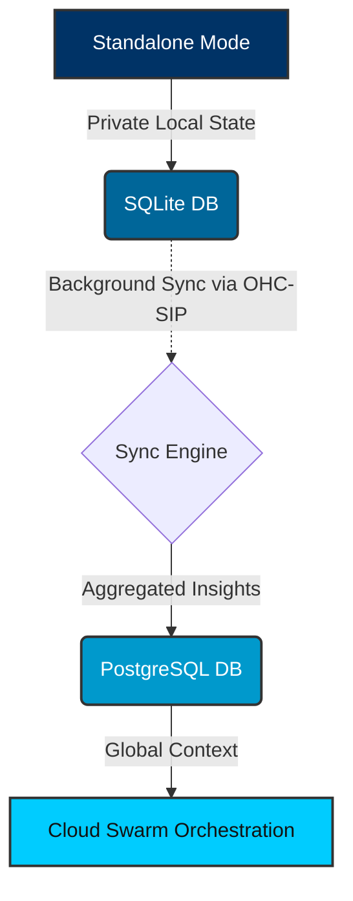

<h1 style="font-weight: 600; color: #FFFFFF; margin-bottom: 16px;">Hybrid MCP RAG Protocol: Bridging Standalone SQLite to Cloud PostgreSQL</h1>

The Hybrid Architecture (OHC-HA) seamlessly integrates offline, private local execution with robust, scalable cloud infrastructure. The Hybrid MCP RAG Protocol synchronizes the local SQLite RAG state to the cloud Postgres orchestration engine via OHC-SIP, allowing private execution locally with cloud escalation.

<h2 style="font-weight: 500; color: #FFFFFF; margin-top: 24px; margin-bottom: 12px;">Architecture Overview</h2>

<h2 style="font-weight: 500; color: #FFFFFF; margin-top: 24px; margin-bottom: 12px;">Data Flow</h2>
<ul style="line-height: 1.6; color: #B0B0B0;">
    <li>Standalone Agent extracts insights and stores them in local SQLite.</li>
    <li>Sync Daemon periodically queries for pending rows and batches them.</li>
    <li>Payload is encrypted and sent via mutually authenticated TLS (SPIFFE/SPIRE).</li>
    <li>Cloud Gateway validates and upserts into the multi-tenant Postgres DB.</li>
    <li>Gateway responds with success, and local Sync Daemon marks rows as synced.</li>
</ul>

