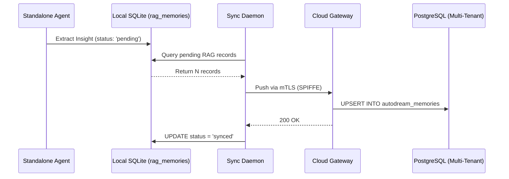

# Hybrid MCP RAG Sync: Bridging Standalone and Cloud

One Human Corp (OHC) provides unmatched privacy and scalability through its Hybrid Architecture (OHC-HA). This walkthrough explains how the **Hybrid MCP RAG Protocol** syncs local standalone execution data (SQLite) with the multi-tenant orchestration engine (PostgreSQL).

## 1. The Core Dilemma

Most agentic platforms force a binary choice:
- **Cloud-Only:** Infinite scalability, but complete surrender of data sovereignty.
- **Local-Only:** Strict privacy, but computationally bound by a single machine.

OHC solves this via **Dynamic Escalation**. By default, your data stays in your local SQLite `rag_memories` table. Only when massive parallel computation is requested does the OHC Sync Daemon securely push the embedded insights into the Cloud Swarm.

## 2. Synchronization Pipeline

The Local-to-Cloud Sync Engine works in the background to ensure your local AI interactions augment the global swarm memory seamlessly.

## 3. Resolving Conflicts

Because you might be running agents both locally and remotely at the same time, conflicts can arise. OHC uses a **Last-Write-Wins (LWW)** strategy based on the `last_sync_timestamp`.

  <strong>💡 Pro-Tip:</strong> The synchronization happens purely via vector embeddings (1536 dimensions) and semantic summaries. Raw PII data is never exfiltrated unless explicitly authorized by the Human CEO.

