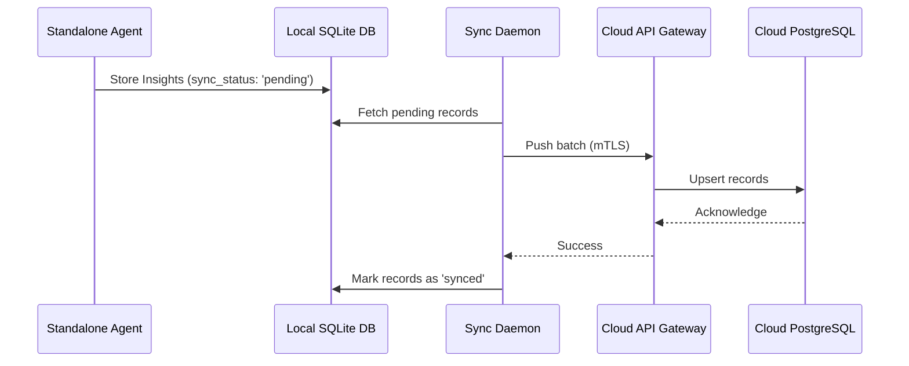

<div markdown="1" style="backdrop-filter: blur(20px) saturate(200%); font-family: 'Outfit', 'Inter', sans-serif; border: 1px solid rgba(255, 255, 255, 0.1); padding: 20px; border-radius: 12px; background: rgba(255, 255, 255, 0.05); color: #fff;">

# Hybrid MCP RAG Protocol: Visual Walkthrough

This guide details the architectural flow of the Hybrid MCP RAG (Retrieval-Augmented Generation) Protocol, which enables OHC to bridge the gap between offline, private local execution and multi-tenant cloud scaling.

## 1. Overview of the Hybrid RAG Architecture

The Hybrid MCP RAG Protocol synchronizes a local SQLite RAG state to the cloud Postgres orchestration engine via the Swarm Intelligence Protocol (OHC-SIP). This architecture guarantees privacy locally while enabling cloud escalation when massive parallel computation is required.

### Architecture Comparison

```mermaid
graph TD
    A[Standalone Mode] -->|Private Local State| B[(SQLite DB)]
    B -.->|Background Sync via OHC-SIP| C{Sync Engine}
    C -->|Aggregated Insights| D[(PostgreSQL DB)]
    D -->|Global Context| E[Cloud Swarm Orchestration]

    classDef premium fill:rgba(255,255,255,0.03),stroke:rgba(255,255,255,0.08),stroke-width:1px,color:#fff,backdrop-filter:blur(20px) saturate(200%);
    class A,B,C,D,E premium;
```

## 2. Sync Lifecycle

The RAG sync lifecycle ensures robust and conflict-free synchronization of context data.

1. **Local Extraction**: A Standalone Agent extracts insights and stores them in the local SQLite database.
2. **Batching**: A lightweight Sync Daemon periodically queries for pending rows and batches them.
3. **Secure Transmission**: The payload is securely transmitted over TLS (mutually authenticated via SPIFFE/SPIRE).
4. **Cloud Upsert**: The Cloud API Gateway receives, validates, and upserts the data into the multi-tenant PostgreSQL database.
5. **Acknowledgment**: The Gateway responds with success, and the local Sync Daemon marks the rows as synced.



## 3. Implementation Details

- **Cloud Mode**: Relies on a robust multi-tenant PostgreSQL setup.
- **Standalone Mode**: Utilizes an internal `rag_memories` SQLite table with a `sync_status` column.
- **Observability**: Built-in OpenTelemetry metrics track `rag_records_synced_total` and `rag_sync_errors_total` for full-spectrum visibility.

</div>
