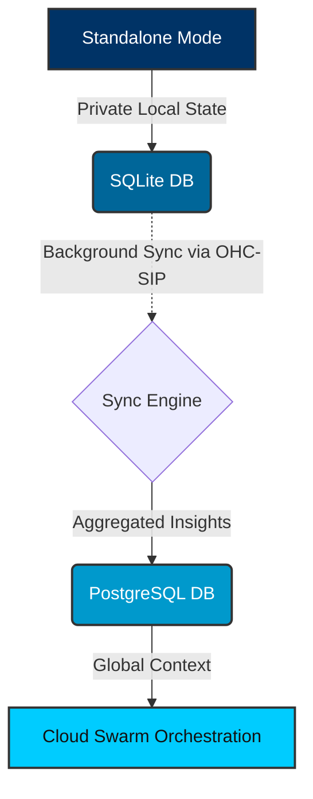

# Walkthrough: Hybrid MCP RAG Sync

This walkthrough covers how One Human Corp orchestrates robust synchronization of multi-agent memory states. OHC seamlessly bridges local privacy boundaries and cloud processing scale using our **Hybrid MCP RAG Protocol**.

## Core Architecture

In local desktop settings (**Standalone Mode**), the AI Swarm preserves user data privacy using a local SQLite persistence layer. When large context windows or massive computational parallelization are necessary, the Sync Engine pushes aggregated semantic memories from local storage into the central Cloud Postgres orchestrator.

The architecture flows seamlessly from an encrypted local domain into high-availability cloud boundaries.

## Component Data Flow

## How It Works

1.  **Local Memory Capture**: A Standalone Agent extracts insights and stores them within the local SQLite instance.
2.  **Sync Daemon Wake**: A lightweight sync process monitors the database and batches memories marked with `sync_status = 'pending'`.
3.  **Secure Transit**: Payloads are encrypted and transmitted through mutually authenticated TLS (SPIFFE/SPIRE).
4.  **Cloud Ingestion**: The OHC Cloud Gateway receives and validates the encrypted memories, performing multi-tenant upserts into the `autodream_memories` Postgres vector database.
5.  **State Reflection**: The local client updates the database `sync_status` to `synced` after successful validation from the gateway.

