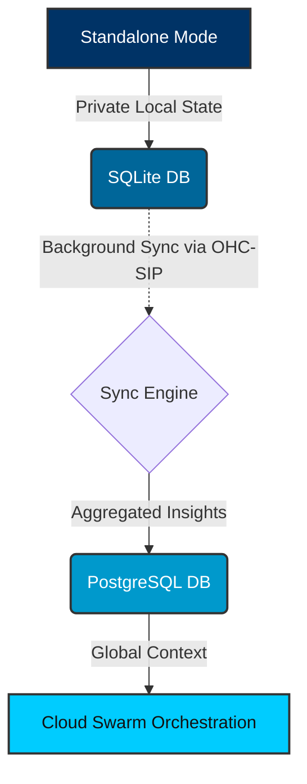

# Hybrid MCP RAG Protocol Walkthrough

Welcome to the interactive walkthrough for the **Hybrid MCP RAG Protocol**. This guide details how the One Human Corp (OHC) Hybrid Architecture seamlessly synchronizes offline, private local RAG state (Standalone Mode) to the cloud Postgres orchestration engine (Cloud Mode) using the Swarm Intelligence Protocol (OHC-SIP).

## 1. Bridging the Gap: Privacy vs Scalability

Traditional Agentic OS implementations force a binary choice: trade privacy for cloud-scale execution, or trade scalability for local privacy. The **Hybrid MCP RAG Protocol** eliminates this tradeoff.

By operating in Standalone Mode, highly sensitive datasets can be processed locally using SQLite. When a generalized task requires massive parallel computation, non-PII context payloads are securely escalated to the multi-tenant K8s cloud swarm.

## 2. Synchronization Architecture

The synchronization flow uses a background daemon to monitor local context changes and batch them to the Cloud Gateway via mutually authenticated TLS.

### Data Flow Execution
1. **Local Insight Extraction:** The Standalone Agent extracts insights and stores them in the local SQLite database.
2. **Daemon Polling:** The local Sync Daemon periodically wakes up, querying for rows where `sync_status = 'pending'`, and batches them.
3. **Secure Uplink:** The payload is encrypted and transmitted to the API Gateway via mutually authenticated TLS (SPIFFE/SPIRE).
4. **Cloud Upsert:** The Cloud Gateway validates the payload and upserts the insights into the multi-tenant Postgres DB.
5. **Confirmation:** The Gateway responds with success, and the local Sync Daemon marks the rows as `synced`.

## 3. Implementation and Security

- **Zero Secrets Authentication:** The protocol relies purely on SPIFFE/SPIRE to authenticate the standalone instance communicating with the OHC Cloud Gateway.
- **Conflict Resolution:** A CRDT-based or Last-Write-Wins (LWW) strategy is employed to resolve potential state divergence between the local standalone machine and the cloud database.
- **Graceful Degradation:** If the cloud gateway is unreachable, the daemon queues the payloads locally and automatically retries with exponential backoff.

