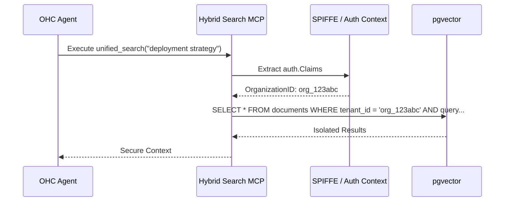

<div markdown="1" style="backdrop-filter: blur(20px) saturate(200%); font-family: 'Outfit', 'Inter', sans-serif; border: 1px solid rgba(255, 255, 255, 0.1); padding: 20px; border-radius: 12px; background: rgba(255, 255, 255, 0.05); color: #fff;">

# Hybrid Search MCP Server Walkthrough

Welcome to the visual guide for the **Hybrid Search MCP Server**. This feature allows OHC agents to seamlessly search for internal documentation and external resources, gracefully adapting its strategy based on the current operational mode (`OHC_STANDALONE`).

## 1. The Core Architecture

The Hybrid Search MCP abstracts the complexity of data retrieval behind a unified interface (`mcp.SearchProvider`), allowing agents to use standard tools (`unified_search`, `index_document`) without needing to understand the underlying storage backend.

```mermaid
graph TD
    Agent[OHC Sub-Agent] -->| unified_search | MCP[Hybrid Search MCP Server]
    MCP --> Router{Is OHC_STANDALONE=true?}

    Router -->|Yes| LocalProvider[LocalSearchProvider]
    LocalProvider --> SQLite[(Local SQLite DB FTS5)]
    LocalProvider -.->|Fallback| MinimalWebSearch[Rate-Limited Web API]

    Router -->|No| CloudProvider[CloudSearchProvider]
    CloudProvider --> SecurityGate{Tenant Isolation auth.Claims.OrganizationID}
    SecurityGate --> PGVector[(Distributed PostgreSQL pgvector)]
    CloudProvider -.->|Enrichment| EnterpriseWebSearch[Tavily / Brave Search API]

    classDef premium fill:rgba(255,255,255,0.03),stroke:rgba(255,255,255,0.08),stroke-width:1px,color:#fff,backdrop-filter:blur(20px) saturate(200%);
    class Agent,MCP,LocalProvider,CloudProvider premium;
    class SQLite,PGVector premium;
```

## 2. Security and Multi-Tenancy (Cloud Mode)

In Cloud-Native mode, security is paramount. The system automatically scopes all search queries and indexed documents to the agent's current tenant using the injected `auth.Claims`. This completely prevents cross-tenant data leakage.



## 3. Graceful Degradation (Standalone Mode)

When operating locally, the MCP prioritizes privacy and low resource consumption by leveraging SQLite's Full-Text Search (FTS5) capabilities, eliminating the need for complex distributed databases while maintaining search efficacy.

</div>
