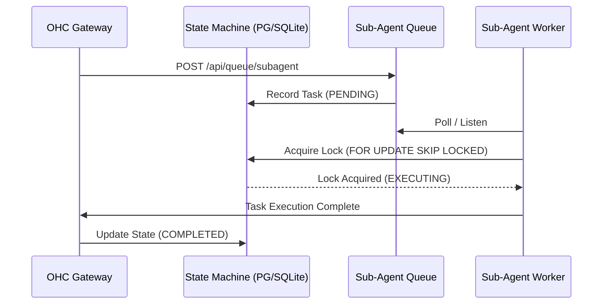
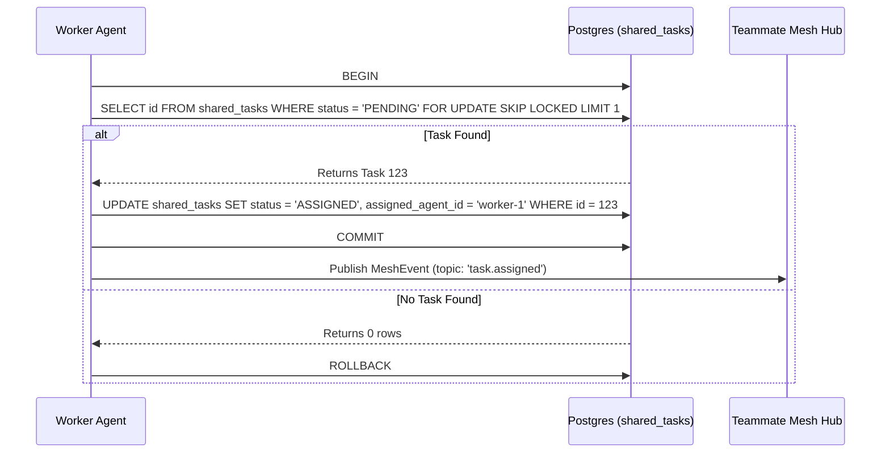

<div markdown="1" style="backdrop-filter: blur(20px) saturate(200%); font-family: 'Outfit', 'Inter', sans-serif; border: 1px solid rgba(255, 255, 255, 0.1); padding: 20px; border-radius: 12px; background: rgba(255, 255, 255, 0.05); color: #fff;">

# Interactive API Playbook Walkthrough

Welcome to the **Interactive API Playbook**. This walkthrough guide provides visual context for the KAIROS Orchestration APIs described in the `docs/api/playbook.md`, highlighting the interplay between different system components.

## 1. Sub-Agent Queue Orchestration Flow

This workflow illustrates how a primary agent delegates sub-tasks to the highly available distributed queue.



The system is backed by Redis ZSETs (via `rueidis`) in Cloud-Native mode or a mutex-protected SQLite table in Standalone mode. This ensures horizontal scalability in Kubernetes while degrading gracefully on local machines.

## 2. Shared Task Claiming Workflow

For the primary Shared Task List, worker agents claim pending tasks.



## 3. AutoDream Vector Embedding Workflow

Once an agent completes a task, it writes its session memory to `.agent-task/memory`. The AutoDream Pipeline then consolidates this context into the Vector DB.

```mermaid
graph TD
    Trigger[POST /api/v1/autodream/] --> Hub[Orchestration Hub]
    Hub --> Parser[Memory Artifact Parser]
    Parser --> Embedding[LLM Embedding Model]
    Embedding --> VectorDB[(pgvector / Local SQLite)]
    VectorDB --> RAGSync[RAG Sync Engine]
    RAGSync --> Mesh[Teammate Mesh Broadcast]

    classDef premium fill:rgba(255,255,255,0.03),stroke:rgba(255,255,255,0.08),stroke-width:1px,color:#fff,backdrop-filter:blur(20px) saturate(200%);
    class Trigger,Hub,Parser,Embedding,VectorDB,RAGSync,Mesh premium;
```

This API (`POST /api/v1/autodream/`) can be triggered manually to immediately consolidate recent agent context, making it available for future Retrieval-Augmented Generation (RAG) tasks across the swarm.

</div>
