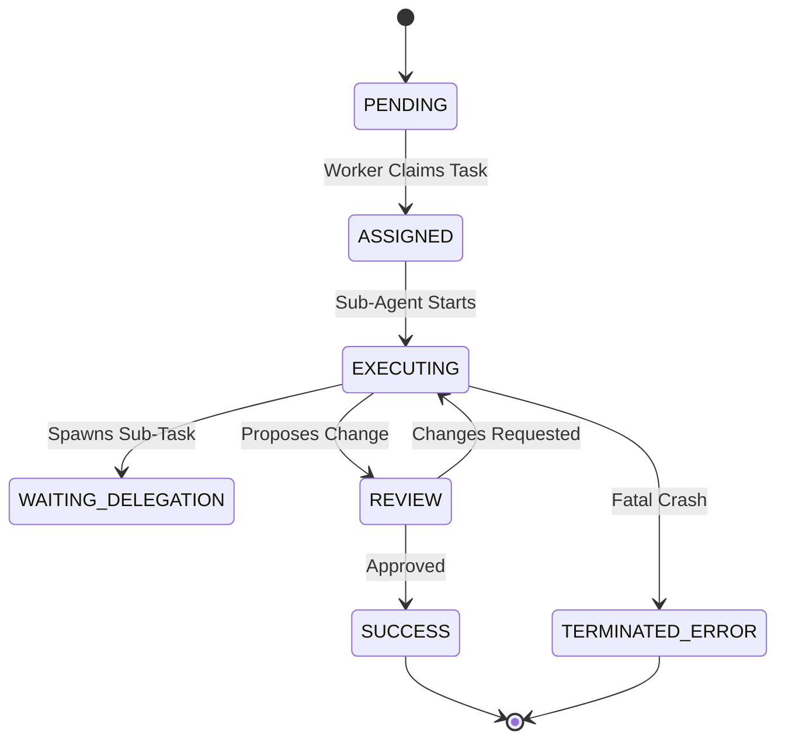
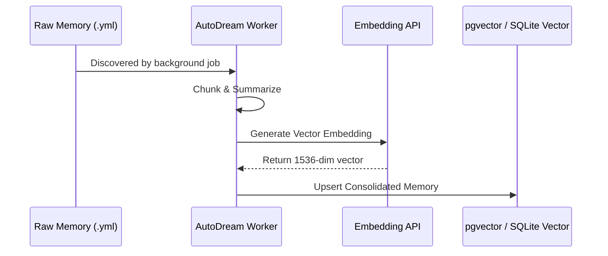

<div markdown="1" style="backdrop-filter: blur(20px) saturate(200%); font-family: 'Outfit', 'Inter', sans-serif; border: 1px solid rgba(255, 255, 255, 0.1); padding: 20px; border-radius: 12px; background: rgba(255, 255, 255, 0.03); color: #fff;">

# KAIROS Architecture Walkthrough

Welcome to the interactive walkthrough for the advanced KAIROS orchestration components. The OHC Hybrid Architecture relies on these robust mechanisms to seamlessly scale from local desktop single-agent tasks to multi-tenant cloud-native Swarm Intelligence.

## 1. KAIROS Sub-Agent Orchestration Queue

When a complex task is delegated, the system breaks it down into sub-tasks. The KAIROS Sub-Agent Queue ensures reliable, at-least-once delivery, whether you're backed by a local SQLite mutexed table or distributed Redis ZSETs.

```mermaid
graph TD
    Hub[Orchestration Hub] -->|Enqueues Task| Queue[(Sub-Agent Queue)]
    Queue -->|Standalone| SQLite[SQLite Local DB]
    Queue -->|Cloud-Native| Redis[Redis / Rueidis]
    SQLite -->|Dequeues| Worker[Sub-Agent Worker]
    Redis -->|Dequeues| Worker
    Worker -->|Completes Task| Hub

    classDef premium fill:rgba(255,255,255,0.03),stroke:rgba(255,255,255,0.08),stroke-width:1px,color:#fff,backdrop-filter:blur(20px) saturate(200%);
    class Hub,Queue,SQLite,Redis,Worker premium;
```

## 2. Distributed State Machine & Teammate Mesh

The KAIROS Distributed State Machine tracks strict state transitions for multi-agent workflows. Using Redis distributed locks (or database row locks in Standalone mode), it guarantees atomicity. Once a state transition is validated, it broadcasts over the Teammate Mesh APIs (via Centrifuge) to keep all participants perfectly in sync.



## 3. AutoDream Data Pipelines

A swarm's true strength lies in its long-term reasoning. The AutoDream pipeline asynchronously consolidates raw episodic memory into semantic vectors, ready for Hybrid RAG querying.



</div>
