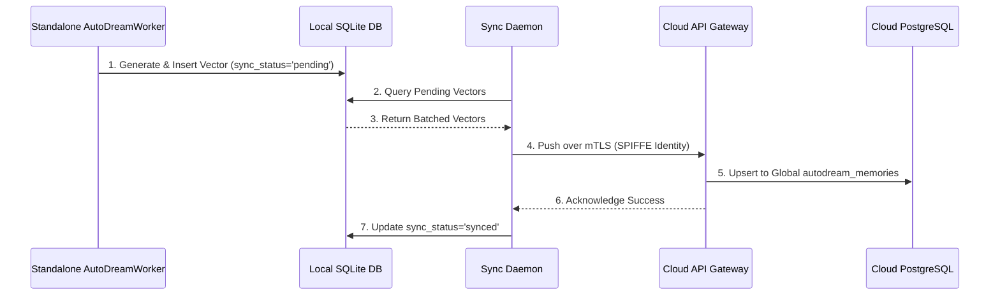

<div markdown="1" style="backdrop-filter: blur(20px) saturate(200%); background: rgba(255, 255, 255, 0.03); font-family: 'Outfit', 'Inter', sans-serif; color: #fff; padding: 20px; border-radius: 12px; border: 1px solid rgba(255, 255, 255, 0.1);">

# KAIROS AutoDream Pipeline: Visual Walkthrough

This document visualizes the **AutoDream Pipeline**, the memory consolidation engine for the KAIROS Orchestrator.

## Architectural Overview

AutoDream continuously embeds ephemeral agent session contexts into durable long-term memory via `pgvector` (in Cloud mode) and a simulated local vector store (in Standalone Desktop mode).

### Data Flow

```mermaid
graph TD
    Agent[Worker Agent] -->|Produces| SessionData(agent_session_data)
    Agent -->|Produces| MemoryFiles(OHC_MEMORY_DIR/*.yml)

    SessionData -->|Periodic Sweeps| AutoDreamWorker
    MemoryFiles -->|Periodic Sweeps| AutoDreamWorker

    subgraph AutoDream Engine
        AutoDreamWorker[AutoDream Worker Daemon] -->|Chunks Data| Chunker[Chunk & Tokenize]
        Chunker -->|Requests Embeddings| EmbedAPI[Embedding API (Minimax/Cohere)]
        EmbedAPI -->|Returns Vectors| VDB_Insert{Vector Storage}
    end

    VDB_Insert -->|Cloud Native Mode| PGVector[(PostgreSQL pgvector)]
    VDB_Insert -->|Standalone Mode| SQLite[(SQLite + Blob Fallback)]

    PGVector -->|Semantic Search| RAG[Agent Context Retrieval]
    SQLite -->|Semantic Search| RAG

    classDef premium fill:rgba(255,255,255,0.03),stroke:rgba(255,255,255,0.08),stroke-width:1px,color:#fff,backdrop-filter:blur(20px) saturate(200%);
    class Agent,SessionData,MemoryFiles,AutoDreamWorker,Chunker,EmbedAPI,VDB_Insert,PGVector,SQLite,RAG premium;
```

---

## 1. Execution Lifecycle

The pipeline operates as a distributed background worker, ensuring that the primary Teammate Mesh and task orchestration aren't slowed down by heavy vector processing:

1. **Sweep**: The background worker scans completed tasks and recently closed session data (typically anything older than an hour but untouched).
2. **Chunk**: The content is divided into overlapping blocks to maintain semantic meaning.
3. **Embed**: The chunks are sent to the embedding model (e.g., Minimax, Cohere, or local LLMs).
4. **Persist**: The 1536-dimensional embeddings are saved:
   - In **Cloud Mode**, using `pgvector` for scalable nearest-neighbor queries.
   - In **Standalone Mode**, gracefully degrading to SQLite.
5. **Prune**: The original verbose `agent_session_data` is truncated to free up storage, achieving "zero-WIP" cleanliness.

---

## 2. Hybrid Synchronization

The Hybrid AutoDream Synchronization enables "Infinite Scaling" while retaining local privacy. Local intelligence vectors are periodically batch-synced from Standalone mode to the Cloud Hub.



---

## Next Steps
- [Interactive CLI Guide](./autodream_cli_interactive_guide.md)
- [Teammate Mesh Walkthrough](../technical/walkthroughs/teammate_mesh.md)

</div>
