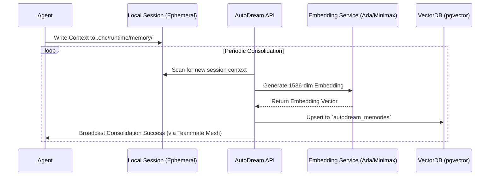

# KAIROS AutoDream Pipeline: Visual Walkthrough

This document visualizes the **AutoDream Pipeline**, the memory consolidation engine for the KAIROS Orchestrator.

## Architectural Overview

AutoDream continuously embeds ephemeral agent session contexts into durable long-term memory via `pgvector` (in Cloud mode) and a simulated local vector store (in Standalone Desktop mode).

## Hybrid Resilience

OHC is designed for "Hybrid Parity". Whether running in a massive Kubernetes cluster or on a single developer laptop, the AutoDream pipeline ensures semantic continuity.

### Cloud Mode
- **Persistence:** PostgreSQL with `pgvector` extension.
- **Embeddings:** High-throughput cloud APIs (OpenAI Ada / Minimax).
- **Scale:** Multi-tenant isolation at the database row level.

### Standalone Mode
- **Persistence:** Local SQLite with vector simulation.
- **Embeddings:** Localized or efficient edge API calls.
- **Privacy:** All session data remains on the local machine until explicitly synced.

---

## Next Steps
- [Interactive CLI Guide](./autodream_cli_interactive_guide.md)
- [Teammate Mesh Walkthrough](../technical/walkthroughs/teammate_mesh.md)

