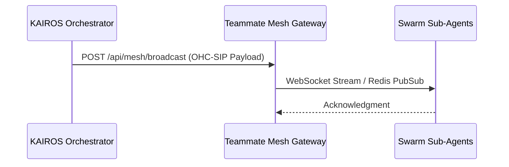

# KAIROS Distributed Master Mesh Architecture Walkthrough

This document provides a technical walkthrough of the Realtime Transport mechanisms for KAIROS Orchestrator.

## Overview

The One Human Corp (OHC) AI OS leverages the Teammate Mesh to guarantee low-latency, real-time synchronization between agents, Sub-Agents, and the Human UI.

## Realtime Transport Diagram

## Unified API Gateway Compliance

All payloads broadcasted through the Mesh must strictly adhere to the OHC-SIP validation standards:
- `agent_id`
- `channel`
- `event_type`
- `data`

## Standalone Degradation

In Local Standalone Mode, the system bypasses Redis Pub/Sub, falling back gracefully to an in-memory Go transport matrix with zero UI friction.

