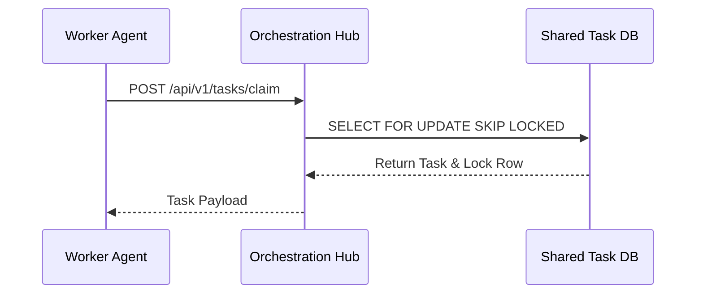
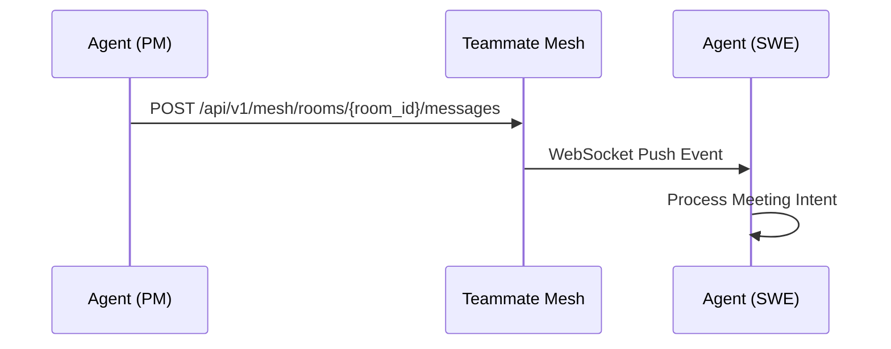
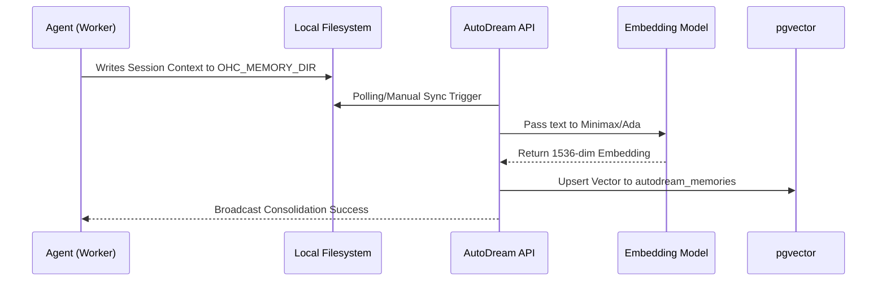
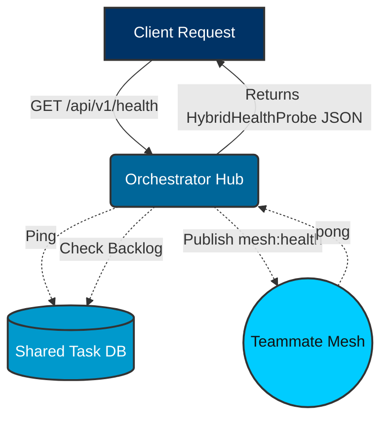
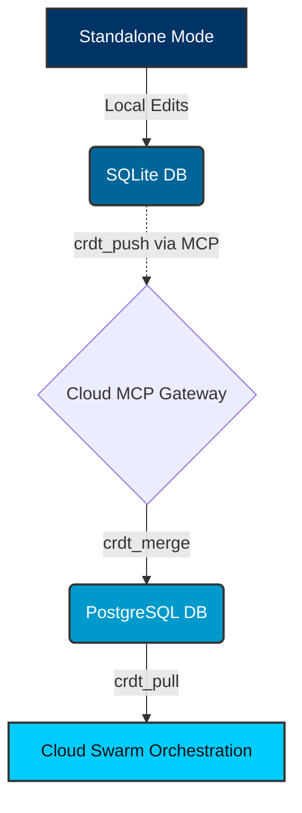

<div markdown="1" style="backdrop-filter: blur(20px) saturate(200%); font-family: 'Outfit', 'Inter', sans-serif; background: rgba(255, 255, 255, 0.03); color: #fff; padding: 20px; border-radius: 12px; border: 1px solid rgba(255, 255, 255, 0.1);">

# KAIROS Interactive API Playbook Walkthrough

Welcome to the interactive walkthrough for the KAIROS Orchestration APIs.

## Teammate Mesh Architecture

```mermaid
graph TD
    subgraph Swarm
        A1[Worker Agent 1]
        A2[Worker Agent 2]
    end

    subgraph Teammate Mesh (Redis/Centrifugo)
        M[Mesh Hub]
    end

    A1 <-->|Pub/Sub| M
    A2 <-->|Pub/Sub| M

    classDef premium fill:rgba(255,255,255,0.03),stroke:rgba(255,255,255,0.08),stroke-width:1px,color:#fff,backdrop-filter:blur(20px) saturate(200%);
    class A1,A2,M premium;
```

## Comparative Features

| Feature | KAIROS | Legacy |
| :--- | :--- | :--- |
| **Messaging** | Centrifugo / Redis | Bare WebSockets |
| **Task Claiming** | `FOR UPDATE SKIP LOCKED` | Memory Queue |
| **Scalability** | Horizontal (Cloud) / SQLite (Standalone) | Monolithic |

## Interactive Endpoints

### 1. Enqueue Task
**POST** `/api/queue/subagent`

```bash
curl -X POST https://api.onehumancorp.com/api/queue/subagent \
  -H "Authorization: Bearer <your_spiffe_token>" \
  -H "Content-Type: application/json" \
  -d '{
    "parent_task_id": "T-123",
    "action": "summarize"
  }'
```

### 2. Broadcast Message
**POST** `/api/mesh/v2/broadcast`

```bash
curl -X POST https://api.onehumancorp.com/api/mesh/v2/broadcast \
  -H "Authorization: Bearer <your_spiffe_token>" \
  -H "Content-Type: application/json" \
  -d '{
    "channel": "swarm-events",
    "data": {
      "event": "status_update",
      "status": "IN_PROGRESS"
    }
  }'
```

### 3. Hybrid Health Probe
**GET** `/api/v1/health`

```bash
curl -X GET https://api.onehumancorp.com/api/v1/health \
  -H "Authorization: Bearer <your_spiffe_token>"
```
**Response**: `{"mode": "cloud", "status": "healthy", "db_ping": 15000000, "sync_backlog": 0, "stuck_missions": 0, "mesh_active": true}`

### 4. Hybrid CRDT Sync MCP Tools
**Tool Invoke**: `crdt_push`

```bash
curl -X POST https://api.onehumancorp.com/api/mcp/invoke \
  -H "Authorization: Bearer <your_spiffe_token>" \
  -H "Content-Type: application/json" \
  -d '{
    "tool": "crdt_push",
    "payload": {
      "entity_id": "task_12345",
      "mutations": [
        {"clock": 42, "op": "set", "path": "status", "value": "COMPLETED"}
      ]
    }
  }'
```

### 5. Task Claiming
**POST** `/api/v1/tasks/claim`

```bash
curl -X POST https://api.onehumancorp.com/api/v1/tasks/claim \
  -H "Authorization: Bearer <your_spiffe_token>" \
  -H "Content-Type: application/json" \
  -d '{
    "agent_id": "agent_swe_007",
    "role": "swe"
  }'
```



### 6. Publish to Virtual Room
**POST** `/api/v1/mesh/rooms/{room_id}/messages`

```bash
curl -X POST https://api.onehumancorp.com/api/v1/mesh/rooms/123/messages \
  -H "Authorization: Bearer <your_spiffe_token>" \
  -H "Content-Type: application/json" \
  -d '{
    "agent_id": "agent_pm_001",
    "action": "ultraplan_deliberation",
    "status": "active",
    "payload": {
      "content": "I propose we use pgvector instead of Pinecone for AutoDream."
    }
  }'
```



### 7. Trigger AutoDream Sync
**POST** `/api/v1/autodream/sync`

```bash
curl -X POST https://api.onehumancorp.com/api/v1/autodream/sync \
  -H "Authorization: Bearer <your_spiffe_token>" \
  -H "Content-Type: application/json" \
  -d '{
    "force_reindex": false
  }'
```



## Hybrid Architecture Visualizations

### Hybrid Health Probe Flow



### Hybrid CRDT State Synchronization



</div>
