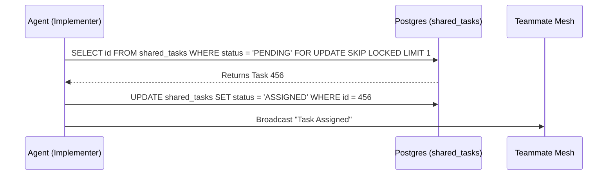

<div markdown="1" style="backdrop-filter: blur(20px) saturate(200%); font-family: 'Outfit', 'Inter', sans-serif; border: 1px solid rgba(255, 255, 255, 0.1); padding: 20px; border-radius: 12px; background: rgba(255, 255, 255, 0.03); color: #fff;">

# KAIROS Orchestration Walkthrough

Welcome to the KAIROS Orchestration interactive walkthrough. KAIROS is the highly autonomous, distributed brain behind the One Human Corp (OHC) Swarm. It empowers agents to seamlessly share tasks, communicate in real-time, and consolidate memory.

## The KAIROS Triad

The KAIROS engine achieves absolute autonomy and reliability through three core pillars:

1. **Shared Task List (The Brain)**
2. **Teammate Mesh (The Nerves)**
3. **AutoDream (The Memory)**

```mermaid
graph TD
    subgraph Swarm Execution
        A1[Worker Agent 1]
        A2[Worker Agent 2]
    end

    subgraph KAIROS Orchestrator
        T[(Shared Task List)]
        M[Teammate Mesh / Redis]
        AD[AutoDream Pipeline]
        V[(pgvector / Embedded Memory)]
    end

    A1 <-->|Pub/Sub Sync| M
    A2 <-->|Pub/Sub Sync| M

    A1 -->|Claim Task FOR UPDATE SKIP LOCKED| T
    A2 -->|Claim Task FOR UPDATE SKIP LOCKED| T

    T -.->|Completions| AD
    AD -->|Compress & Embed| V
    A1 -->|Semantic RAG Search| V

    classDef premium fill:rgba(255,255,255,0.03),stroke:rgba(255,255,255,0.08),stroke-width:1px,color:#fff,backdrop-filter:blur(20px) saturate(200%);
    class A1,A2,M,T,AD,V premium;
```

---

## 1. Shared Task List (The Brain)

The Shared Task List represents the global queue of decomposed features. It enables complex architectural missions to be broken down and shared securely among agents.

- **Cloud-Native Mode:** Uses PostgreSQL row-level locks (`SELECT ... FOR UPDATE SKIP LOCKED`) to allow massive horizontal concurrency without worker collisions.
- **Standalone Mode:** Gracefully degrades to local SQLite transactions and application-level mutexes for efficiency on a single host.



---

## 2. Teammate Mesh (The Nerves)

The Teammate Mesh is the real-time communication spine of OHC. It handles agent discovery, state synchronization, and real-time coordination.

By utilizing `CentrifugeNode` and Redis Pub/Sub (`rueidis`), agents can broadcast state machine transitions and advertise capabilities with extremely low latency. Advanced routing and filtering ensure agents only wake up for tasks relevant to their specialty.

*(For a deeper look into the transport layers and filtering, see the [Teammate Mesh Walkthrough](teammate_mesh.md).)*

---

## 3. AutoDream Pipeline (The Memory)

To prevent context window overflow while maintaining deep Swarm intelligence, the AutoDream Pipeline periodically consolidates ephemeral session memory into durable, semantic truth.

### Workflow:
1. **Extraction:** A background daemon (`AutoDreamWorker`) polls recent `.agent-task/memory/*.yml` files.
2. **Compression:** The text is compressed using local or cloud LLMs.
3. **Embedding:** The summary is converted into a 1536-dimensional vector.
4. **Loading:** The vector is upserted into the `autodream_memories` table (via `pgvector` in PostgreSQL) allowing agents to perform exact Nearest Neighbor semantic RAG searches for future tasks.

</div>
