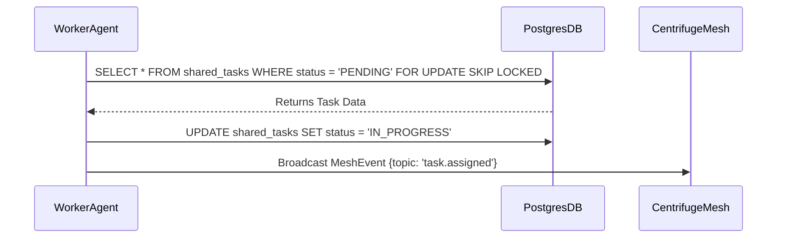

# KAIROS Orchestration: Visual Walkthrough

  <h2 style="margin-top: 0;">The KAIROS Triad</h2>
  
The OHC Swarm Orchestration relies on a unified tri-layer architecture combining memory, messaging, and state.

## 1. Shared Task List (The Brain)

  
The Shared Task List operates as a robust State Machine. Cloud deployments leverage PostgreSQL with <code>FOR UPDATE SKIP LOCKED</code> for horizontal scalability. Standalone desktop deployments gracefully degrade to local SQLite mutexes.

## 2. Teammate Mesh (The Nerves)

  
Powered by CentrifugeNode and Redis Pub/Sub, the Teammate Mesh streams events with sub-millisecond latency. This low-latency layer broadcasts capability advertisements and synchronous worker state transitions.

## 3. AutoDream (The Memory)

  
AutoDream continuously harvests ephemeral session logs, compresses context utilizing local LLMs, and stores dense vectors into a durable pgvector (or Standalone alternative) store. Swarm agents semantically query this database to maintain infinite long-term context.

## Comparative Orchestration Table

| Feature | Legacy System | KAIROS Orchestration |
|---------|---------------|----------------------|
| **Latency** | >500ms (Polling) | <5ms (Mesh) |
| **Concurrency**| Locking Contention | `SKIP LOCKED` |
| **Memory** | Ephemeral | AutoDream (pgvector) |
| **Scaling** | Vertical | Horizontal & Bursting |

## Persona-Specific Pain Point Summaries

- **Maya (The Home Baker):** "I used to lose customer requests when my app refreshed. KAIROS AutoDream ensures the agent remembers our exact DM conversation about vegan cakes."
- **Carlos (The Handyman):** "Double-booking quotes was a nightmare. The Shared Task List's strict locking means my AI never double-commits my schedule."
- **Priya (The Boutique Owner):** "Inventory syncing across online/in-store was slow. The Teammate Mesh broadcasts stock changes instantly, so I never oversell."

## Actionable Recommendations

1. **Leverage Mesh Events:** When building new sub-agents, default to Teammate Mesh pub/sub instead of polling.
2. **Utilize AutoDream:** Ensure agent prompts query the pgvector store for long-term customer context.
3. **Handle Edge Cases:** Implement robust error-handling for DB lock timeouts during peak orchestration bursts.

