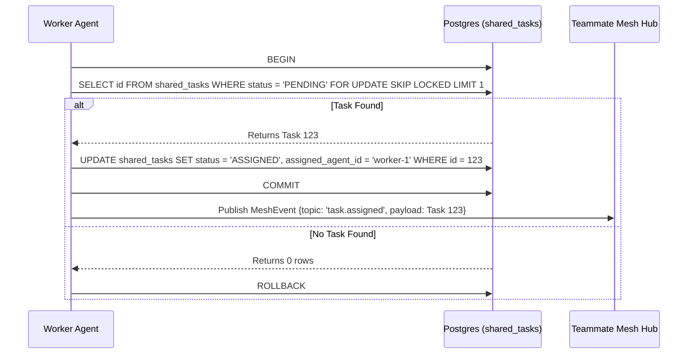

<div markdown="1" style="backdrop-filter: blur(20px) saturate(200%); font-family: Outfit, Inter, sans-serif; border: 1px solid rgba(255, 255, 255, 0.1); padding: 20px; border-radius: 12px; background: rgba(255, 255, 255, 0.05);">

# KAIROS Orchestration: End-to-End Walkthrough

## 1. Introduction
This visual walkthrough guides you through the KAIROS Orchestration APIs, specifically covering the Shared Task List, Teammate Mesh, and Sub-Agent Queue.

## 2. Shared Task List

Agents can claim tasks using the shared queue.



## 3. Sub-Agent Queue

Tasks can be enqueued and dequeued through the distributed state machine.

```mermaid
graph TD
    Manager[Task Manager] -->|Enqueues| API[POST /api/queue/subagent]
    API --> QueueInterface{SubAgent Queue Interface}
    QueueInterface -->|Cloud-Native| Rueidis[(Redis ZSETs)]
    QueueInterface -->|Standalone| SQLite[(SQLite Mutexed Table)]
    Rueidis -->|Dequeues| Worker[Sub-Agent Worker]
    SQLite -->|Dequeues| Worker
    Worker -->|State Transition| V2Mesh[POST /api/mesh/v2/broadcast]
    V2Mesh --> Centrifuge[Centrifuge Node Pub/Sub]
    Centrifuge --> Swarm[Teammate Swarm]

    classDef premium fill:rgba(255,255,255,0.03),stroke:rgba(255,255,255,0.08),stroke-width:1px,color:#fff,backdrop-filter:blur(20px) saturate(200%);
    class Manager,API,QueueInterface,Rueidis,SQLite,Worker,V2Mesh,Centrifuge,Swarm premium;
```

</div>
