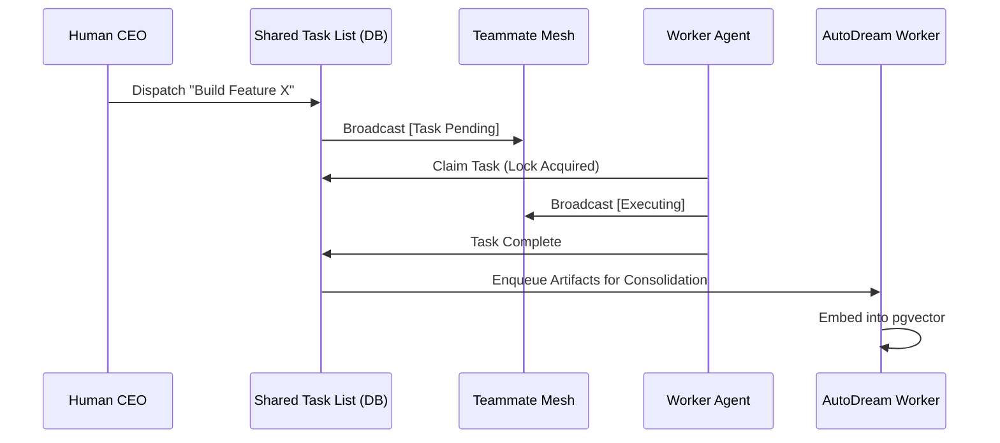

# Walkthrough: The KAIROS Orchestrator

Welcome to the definitive walkthrough for setting up and understanding the **KAIROS Orchestrator** in the One Human Corp (OHC) Hybrid Agentic OS. KAIROS ensures deterministic execution, scalable concurrency, and persistent memory across your Swarm.

## 1. The KAIROS Triad

Before deployment, it's vital to understand the three pillars of KAIROS:

1. **Shared Task List (The Brain):** Tracks states across all multi-agent DAG dependencies using `FOR UPDATE SKIP LOCKED` (Postgres) or Mutexes (SQLite).
2. **Teammate Mesh (The Nerves):** Real-time pub/sub routing via `CentrifugeNode` and Redis for agent-to-agent chatter.
3. **AutoDream Pipeline (The Memory):** Background workers that consolidate context windows via Minimax LLMs and vector embeddings into `pgvector`.

## 2. Orchestration Flow

Here is how an agent interacts with KAIROS during a typical workflow:

## 3. Configuration & Deployment

To deploy KAIROS in your environment, modify your `.env` or application settings according to your target:

### Cloud-Native Mode (Kubernetes)
Ensure your `organization_id` is set. The system will automatically instantiate:
- PostgreSQL with `pgvector` enabled.
- Redis Pub/Sub for the Teammate Mesh.

### Standalone Desktop Mode
If running offline, OHC transparently gracefully degrades:
- SQLite serves as the durable Shared Task List.
- Application-level `sync.Mutex` prevents local worker collision.
- A local metric buffer replaces Redis mesh functionality.

## Next Steps
Review the [Interactive API Playbook](../api_playbook.md) for programmatic integration details!

