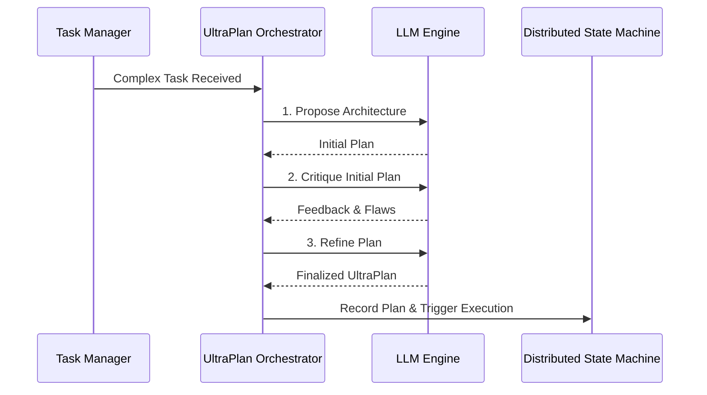

# UltraPlan Deliberation Cycle Walkthrough

Welcome to the visual guide for the **KAIROS UltraPlan Deliberation**. This orchestration ensures that agents meticulously plan, peer-review, and refine architectural choices prior to code execution.

## 1. The Deliberation Loop

The UltraPlan workflow is handled by the `UltraPlan Orchestrator`.

## 2. Distributed Execution
Once deliberation is complete, the resultant UltraPlan sequence is enqueued via the Sub-Agent Queue for isolated task workers.

