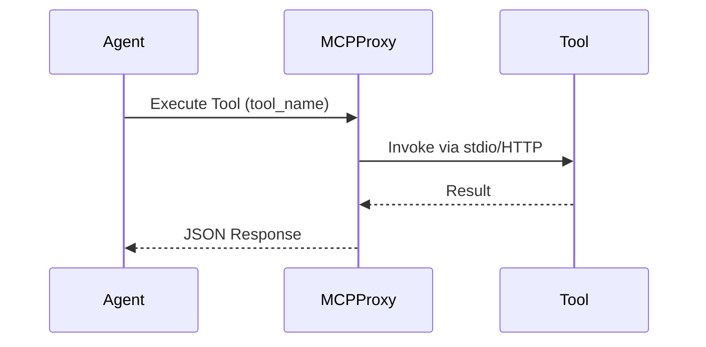

<div markdown="1" style="backdrop-filter: blur(20px) saturate(200%); font-family: 'Outfit', 'Inter', sans-serif; background: rgba(255, 255, 255, 0.03); color: #fff; padding: 20px; border-radius: 12px; border: 1px solid rgba(255, 255, 255, 0.1);">

# MCP Tool Execution Playbook

Welcome to the interactive walkthrough for Model Context Protocol (MCP) Tool Execution.

## Execution Flow



## Interactive Endpoints

### 1. Invoke Tool
**POST** `/api/mcp/invoke`

```bash
curl -X POST https://api.onehumancorp.com/api/mcp/invoke \
  -H "Authorization: Bearer <your_spiffe_token>" \
  -H "Content-Type: application/json" \
  -d '{
    "tool": "crdt_push",
    "payload": {
      "entity_id": "task_123"
    }
  }'
```

</div>
