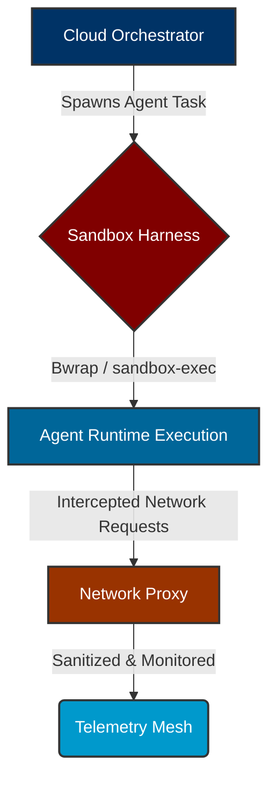

# OS-Level Sandbox Isolation Harness: Visual Walkthrough

This guide details the architecture, configuration, and security guarantees of the new OS-Level Sandbox Isolation Harness (bwrap/sandbox-exec) integration for One Human Corp. It provides a premium visual walkthrough of the security isolation mechanism and how to debug sandbox violations.

## 1. Architectural Flow

The Sandbox Isolation Harness wraps all agent executions in a restricted environment, ensuring that untrusted code cannot access the host file system or network without explicit permission.

## 2. Configuration & Security Guarantees

The integration utilizes either `bwrap` (Linux) or `sandbox-exec` (macOS) to enforce:
- **File System Isolation:** Read-only access to root, with a temporary in-memory filesystem (`tmpfs`) for the workspace.
- **Network Isolation:** All traffic is routed through our internal proxy, blocking unauthorized external domains.
- **Process Isolation:** The agent is given its own PID namespace.

## 3. Debugging Sandbox Violations

When an agent attempts a restricted action, a violation event is emitted to the Telemetry Mesh.
To debug:
1. Access the OHC Observability Dashboard.
2. Filter logs by `event_type: sandbox_violation`.
3. Inspect the attempted path or external domain.

