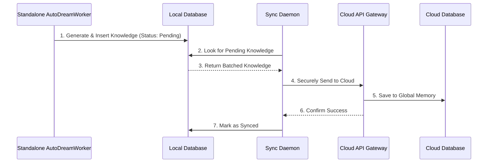

# AutoDream Sync Daemon Walkthrough

Welcome to the AutoDream Sync Daemon guide. This interactive walkthrough explains how the OHC Hybrid Architecture safely stores your local business insights on your device and periodically syncs them to the secure cloud. This ensures your AI agents have all the context they need to help you run your business, whether you're online or offline.

## 1. How the Sync Works

The Hybrid AutoDream Synchronization enables "Infinite Scaling" while retaining local privacy. Your local business data is grouped and sent together safely.

## 2. API Endpoints for Sync

The sync daemon relies on internal APIs to safely transmit your business data.

- **Endpoint:** `POST /api/v1/autodream/sync`
- **Purpose:** Securely send batch updates from your local device to the cloud hub.

For full API specifications, please refer to the [API Playbook](../api/playbook.md).

