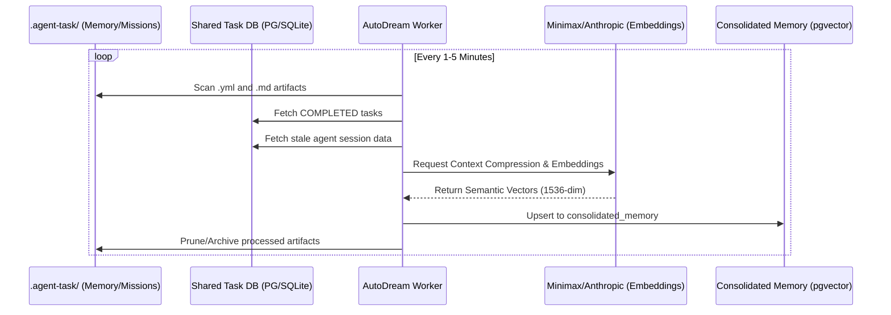

<div markdown="1" style="backdrop-filter: blur(20px) saturate(200%); font-family: 'Outfit', 'Inter', sans-serif; background: rgba(255, 255, 255, 0.03); color: #fff; padding: 20px; border-radius: 12px; border: 1px solid rgba(255, 255, 255, 0.1);">

# Shared Organizational Memory Bank: Visual Walkthrough

This document details the architectural flow of the **Shared Organizational Memory Bank**, powered by the **AutoDream** consolidation pipeline.

## Overview

The Shared Organizational Memory Bank provides a unified, semantic repository of all knowledge, decisions, and outcomes produced by the OHC Swarm. It enables agents to leverage past experiences, preventing redundant work and ensuring organizational consistency.

## 1. Memory Consolidation Flow (AutoDream)

The **AutoDream Worker** continuously monitors ephemeral state sources and consolidates them into long-term vector storage.



## 2. Memory Retrieval Flow (RAG)

Agents and Human CEOs can query the memory bank using natural language to retrieve relevant context.

```mermaid
graph TD
    User[Human CEO / Agent] -->|POST /api/v1/autodream/query| API[OHC Gateway]
    API -->|Generate Embedding| LLM[Embedding Model]
    LLM -->|Vector Query| VectorDB[(Consolidated Memory - pgvector)]
    VectorDB -->|Semantic Match| Results[Relevant Knowledge Fragments]
    Results -->|Context Injection| User

    classDef premium fill:rgba(255,255,255,0.03),stroke:rgba(255,255,255,0.08),stroke-width:1px,color:#fff,backdrop-filter:blur(20px) saturate(200%);
    class User,API,LLM,VectorDB,Results premium;
```

## 3. Conflict Resolution

AutoDream intelligently identifies and resolves contradicting knowledge fragments to maintain a "Single Source of Truth".

```mermaid
graph LR
    M1[Memory A] ---|Similar Vector| M2[Memory B]
    M1 -.-> Conflict{Conflict Detector}
    M2 -.-> Conflict
    Conflict -->|LLM Reasoning| Resolved[Consolidated Truth]
    Resolved -->|Inject| VectorDB[(pgvector)]
    M1 -->|Prune| Trash[Archived]
    M2 -->|Prune| Trash

    classDef premium fill:rgba(255,255,255,0.03),stroke:rgba(255,255,255,0.08),stroke-width:1px,color:#fff,backdrop-filter:blur(20px) saturate(200%);
    class M1,M2,Conflict,Resolved,VectorDB,Trash premium;
```

## Implementation Details

- **Cloud-Native**: Uses `pgvector` for sub-50ms semantic search.
- **Standalone**: Uses a linear search fallback on local SQLite metadata.
- **Security**: All memory access is gated by SPIFFE/SVID and organization-level isolation.

</div>
