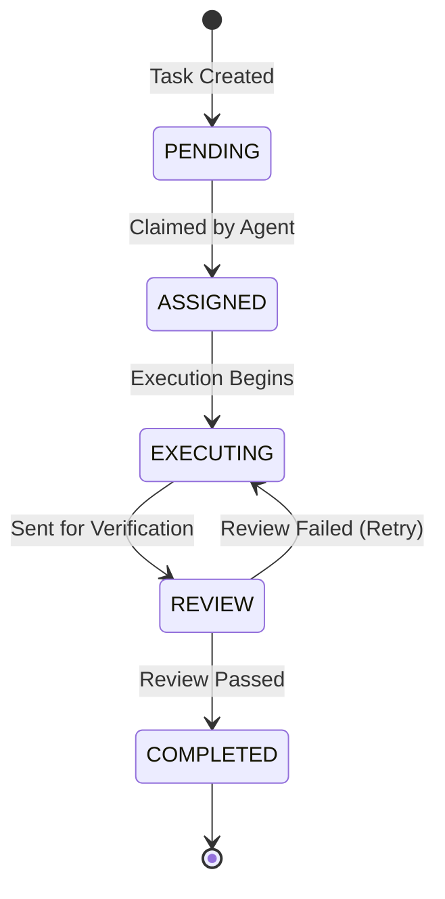

<div markdown="1" style="backdrop-filter: blur(20px) saturate(200%); font-family: 'Outfit', 'Inter', sans-serif; border: 1px solid rgba(255, 255, 255, 0.1); padding: 20px; border-radius: 12px; background: rgba(255, 255, 255, 0.05); color: #fff;">

# Shared Task List: Visual Walkthrough

This guide details the architectural flow of the KAIROS Shared Task List, which acts as "The Brain" of the One Human Corp (OHC) Swarm, decomposing complex human goals into actionable sub-tasks and managing state securely.

## 1. Overview of the Shared Task List

The Shared Task List handles the DAG (Directed Acyclic Graph) of task dependencies and ensures that no two agents can claim the exact same task simultaneously, effectively acting as a distributed locking and state tracking mechanism.

### Shared Task List Architecture

```mermaid
graph TD
    subgraph Swarm Agents
        SWE[Software Engineer]
        PM[Product Manager]
        Scribe[Scribe]
    end

    subgraph KAIROS Orchestrator
        API[Task API]
        SM[State Machine Tracker]
        DB[(Shared Task DB)]
    end

    PM -->|Decomposes Mission| API
    API -->|Persists Task| DB
    SWE -->|Claims Task| API
    Scribe -->|Claims Task| API
    API -->|Transitions State| SM
    SM -->|Updates Record| DB

    classDef premium fill:rgba(255,255,255,0.03),stroke:rgba(255,255,255,0.08),stroke-width:1px,color:#fff,backdrop-filter:blur(20px) saturate(200%);
    class SWE,PM,Scribe,API,SM,DB premium;
```

## 2. Distributed Locking & Graceful Degradation

A key aspect of the Shared Task List is how it manages state across different deployment modes:

- **Cloud-Native Mode (PostgreSQL):** Relies on `FOR UPDATE SKIP LOCKED` clauses. When multiple worker pods query for pending tasks, this SQL feature ensures that an agent locks a specific row during assignment, while other agents immediately skip it and grab the next available task without blocking.
- **Standalone Mode (SQLite):** Since SQLite lacks advanced row-level read/write concurrent locks, the system gracefully degrades. It uses explicit local transaction mutexes to simulate locking, ensuring the single-user Desktop application does not corrupt the local `swarm.db`.

## 3. The State Machine Flow

Tasks managed by the list follow a strict state transition sequence enforced by the Distributed State Machine Tracker.



By unifying the database record state (`swarm_tasks` table) and the transition audit log (`state_machine_transitions` table), the Shared Task List guarantees observability and prevents deadlocks.

</div>
