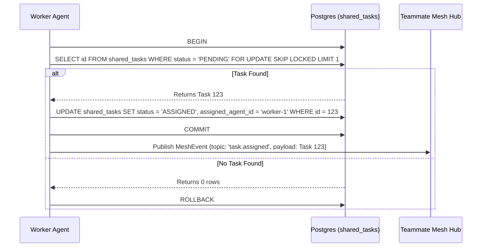

# KAIROS Shared Task List Walkthrough

The Shared Task List operates as the core "brain" of the OHC Swarm. It tracks all pending, active, and completed sub-agent tasks.

## Architecture Flow

## Key Features
- **Cloud Mode (Postgres)**: Utilizes `FOR UPDATE SKIP LOCKED` for concurrent workers.
- **Standalone Mode (SQLite)**: Gracefully degrades to application-level locks and single-connection queueing.

