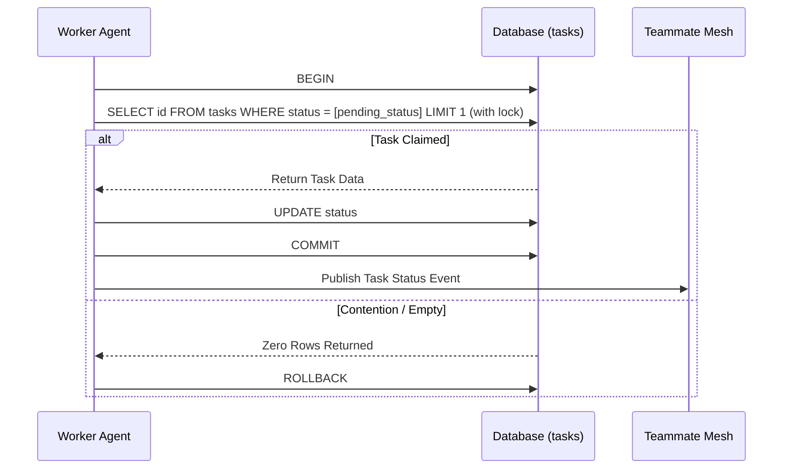

<div markdown="1" style="backdrop-filter: blur(20px) saturate(200%); font-family: 'Outfit', 'Inter', sans-serif; border: 1px solid rgba(255, 255, 255, 0.1); padding: 20px; border-radius: 12px; background: rgba(255, 255, 255, 0.05); color: #fff;">

# Shared Task List: Visual Walkthrough

This guide explains the KAIROS Shared Task List feature, providing insights into how complex missions are decomposed, shared securely among agents, and reliably tracked using a distributed database schema.

## 1. Overview of the Shared Task List

When a complex task is requested by a human operator, it often requires decomposition into smaller, specialized sub-tasks. The Shared Task List handles this state management, persisting these sub-tasks to ensure reliable execution across the Swarm, even if individual agents encounter failures.

### Architecture Deployment

```mermaid
graph TD
    subgraph KAIROS Orchestrator
        Manager[Task Manager] -->|Decomposes Mission| SharedTask[Shared Task Queue]
    end

    SharedTask -->|Cloud| PG[(PostgreSQL)]
    SharedTask -->|Standalone| SQL[(SQLite)]

    PG -->|FOR UPDATE SKIP LOCKED| W1[Agent Pod]
    SQL -->|Local Mutex| W2[Local Agent]

    W1 -->|Claims Task| E[Execution]
    W2 -->|Claims Task| E

    classDef premium fill:rgba(255,255,255,0.03),stroke:rgba(255,255,255,0.08),stroke-width:1px,color:#fff,backdrop-filter:blur(20px) saturate(200%);
    class Manager,SharedTask,PG,SQL,W1,W2,E premium;
```

## 2. DAG Task Dependencies

Tasks within the Shared Task List often rely on the successful completion of other tasks. Dependencies are tracked natively:

- Tasks form a Directed Acyclic Graph (DAG).
- An agent cannot claim a task if its dependencies remain unresolved (e.g., in an incomplete state).
- Once a parent task is marked as finished, its child tasks are automatically unlocked for execution.

## 3. Distributed Claiming Mechanism

To prevent multiple agents from claiming and executing the same task concurrently, the system relies on rigorous transactional locking tailored to the current `OHC-HA` mode:

- **Cloud Mode:** Leverages PostgreSQL row-level locking via `SELECT ... FOR UPDATE SKIP LOCKED`. This guarantees high-throughput parallel consumption without deadlock or blocking.
- **Standalone Mode:** Employs application-level mutexes and standard SQLite transaction isolation levels. This avoids `SQLITE_BUSY` errors inherent in local file-based database architectures.


</div>
