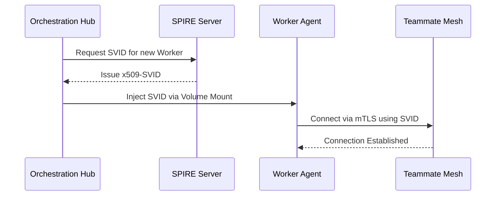

# SPIFFE Identity Onboarding Walkthrough

Welcome to the SPIFFE Identity Onboarding walkthrough. This guide demonstrates how OHC secures inter-agent communication using SPIFFE/SPIRE for mTLS identity validation.

## 1. Zero-Trust Architecture

Every agent in the Swarm receives a cryptographic identity. This ensures that a delegating agent (e.g., Engineering Director) can explicitly verify the identity of a worker agent (e.g., QA Tester) before sharing sensitive `.agent-task/memory` contexts.

## 2. Validation Flow
Once onboarded, all Teammate Mesh events are cryptographically signed. If an agent attempts to publish to `mesh:tasks` without a valid SVID, the Centrifuge proxy will reject the request, preserving the integrity of the Hybrid Architecture.

