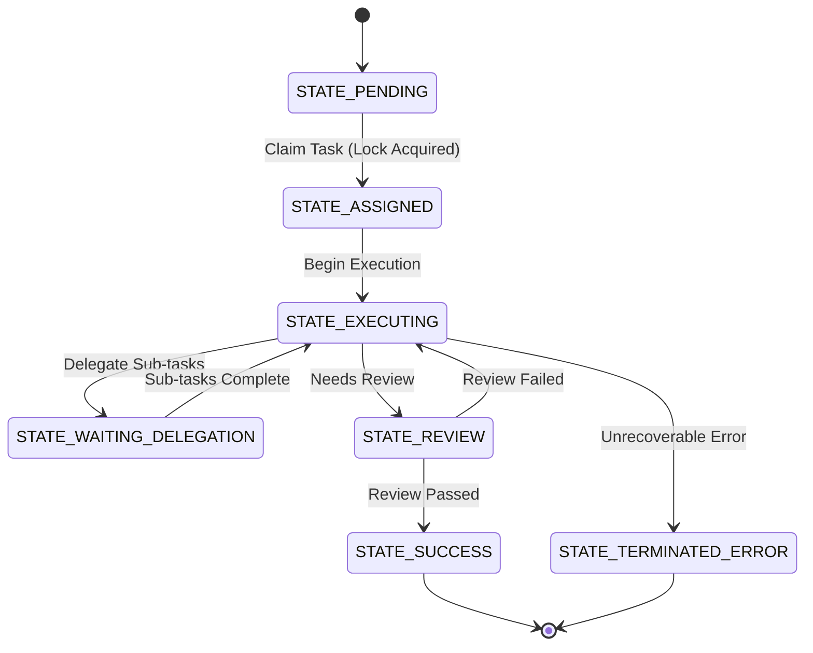

<div markdown="1" style="backdrop-filter: blur(20px) saturate(200%); font-family: 'Outfit', 'Inter', sans-serif; border: 1px solid rgba(255, 255, 255, 0.1); padding: 24px; border-radius: 12px; background: rgba(255, 255, 255, 0.05); color: #ffffff; box-shadow: 0 8px 32px 0 rgba(0, 0, 0, 0.3);">

# KAIROS Distributed State Machine Tracker: Visual Walkthrough

The Distributed State Machine Tracker is a core pillar of the KAIROS Orchestration engine within the One Human Corp (OHC) architecture. It provides a robust, resilient mechanism to track and transition agent coordination states reliably, preventing deadlocks when handling complex task dependencies across the swarm.

## Distributed State Machine Transitions



## State Persistence & Orchestration Locking

Depending on the deployment mode (Hybrid Architecture), the KAIROS engine uses different locking strategies to serialize state transitions and prevent race conditions when horizontally scaling worker pods.

```mermaid
graph TD
    A[Swarm Agent] -->|Request Transition| B{KAIROS API}
    B -->|Cloud-Native Mode| C[Redis 'SET NX EX']
    C -->|Lock Granted| D[(Postgres 'FOR UPDATE')]
    B -->|Standalone Mode| E[SQLite Thread Mutex]
    E -->|Lock Granted| F[(SQLite DB Transaction)]
    D --> G[Audit Log: state_machine_transitions]
    F --> G
    G --> H[Teammate Mesh Broadcast]

    classDef premium fill:rgba(255,255,255,0.03),stroke:rgba(255,255,255,0.08),stroke-width:1px,color:#fff,backdrop-filter:blur(20px) saturate(200%);
    class A,B,C,D,E,F,G,H premium;
```

## Key Benefits
- **Resiliency:** Guaranteed progression of task states regardless of pod failure.
- **Concurrency Safety:** Distributed locking using Redis and row-level Postgres locks prevents collisions between multiple worker pods executing simultaneously.
- **Observability:** Every transition is audit-logged and broadcast to the Teammate Mesh, allowing the human CEO and other agents to view real-time pipeline status without polling the DB.

</div>
