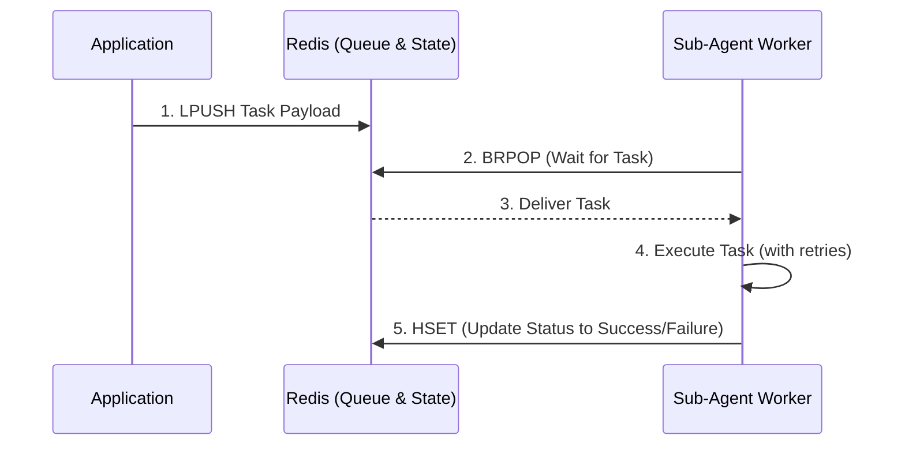
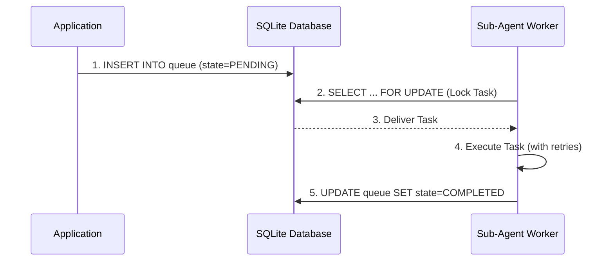

<div markdown="1" style="backdrop-filter: blur(20px) saturate(200%); font-family: 'Outfit', 'Inter', sans-serif; border: 1px solid rgba(255, 255, 255, 0.1); padding: 20px; border-radius: 12px; background: rgba(255, 255, 255, 0.05); color: #fff;">

# Sub-Agent Orchestration Visual Walkthrough

Welcome to the visual walkthrough of the One Human Corp (OHC) Sub-Agent Orchestration Queue! This document explains the architecture and workflow of our task queue system (BullMQ/Celery-style) designed for managing AI agent tasks across different deployment modes.

## 1. Overview

The Sub-Agent Orchestration Queue manages the reliable execution, retry, and scheduling of background jobs performed by sub-agents. It supports both **Cloud Mode** (high scalability via Redis) and **Standalone Mode** (local persistence via SQLite) seamlessly through an abstracted queue interface.

## 2. Orchestration Architecture

The system uses a distributed queue model where tasks are enqueued by the main application or primary agents and processed by a pool of worker sub-agents.

```mermaid
graph TD
    API[API Layer / Primary Agent] -->|Enqueue Task| QueueInterface[Queue Interface]
    QueueInterface -->|Dispatch| WorkerPool[Worker Pool]

    subgraph Worker Pool [Sub-Agent Worker Pool]
        WorkerA[Worker A]
        WorkerB[Worker B]
        WorkerC[Worker C]
    end

    WorkerA -->|Update State| StateDB[(State Storage)]
    WorkerB -->|Update State| StateDB
    WorkerC -->|Update State| StateDB

    classDef premium fill:rgba(255,255,255,0.03),stroke:rgba(255,255,255,0.08),stroke-width:1px,color:#fff,backdrop-filter:blur(20px) saturate(200%);
    class API,QueueInterface,WorkerPool,WorkerA,WorkerB,WorkerC,StateDB premium;
```

## 3. Deployment Modes Comparison

The underlying implementation of the queue adapts to the environment it runs in, providing the same reliability guarantees using different technologies.

### Cloud Mode: Redis-Backed Queue

In Cloud Mode, the system leverages Redis to handle high-throughput, distributed queuing, similar to BullMQ or Celery.



### Standalone Mode: SQLite-Backed Queue

In Standalone Mode, the queue uses SQLite for single-node, durable local execution without requiring external dependencies like Redis.



## 4. Key Features

- **Reliability:** Dead-letter queues for persistent failures.
- **Exponential Backoff:** Configurable retry mechanisms for transient errors.
- **Unified Interface:** Developers enqueue tasks the same way regardless of the underlying backend (Redis vs. SQLite).
- **Concurrency:** Built-in worker pooling ensures maximum throughput without overloading the system.

</div>
