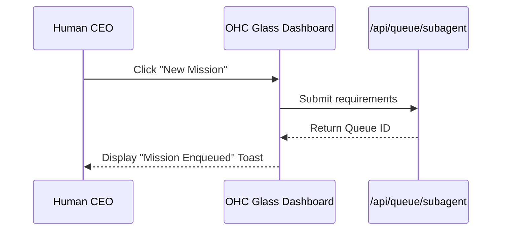

<div markdown="1" style="backdrop-filter: blur(20px) saturate(200%); font-family: 'Outfit', 'Inter', sans-serif; border: 1px solid rgba(255, 255, 255, 0.1); padding: 20px; border-radius: 12px; background: rgba(255, 255, 255, 0.05); color: #fff;">

# KAIROS Sub-Agent Queue Interactive UI Guide

Welcome to the **Sub-Agent Queue Interactive UI Guide**. This guide illustrates how the Human CEO visually interacts with the orchestration queue and teammate mesh through the premium OHC interface.

## Overview

The OHC platform utilizes the KAIROS Sub-Agent Queue to coordinate task delegation and task processing across thousands of individual sub-agents. The Interactive UI visualizes these operations in real-time.

```mermaid
graph TD
    UI[Human UI Dashboard] -->|View Queue| QueueAPI[Sub-Agent Queue API]
    QueueAPI --> Tasks[Pending Tasks]
    Tasks -->|Claimed| Agent[Sub-Agent]
    Agent -->|State Change| Centrifuge[Centrifuge Real-Time Node]
    Centrifuge -->|WebSocket Push| UI

    classDef premium fill:rgba(255,255,255,0.03),stroke:rgba(255,255,255,0.08),stroke-width:1px,color:#fff,backdrop-filter:blur(20px) saturate(200%);
    class UI,QueueAPI,Tasks,Agent,Centrifuge premium;
```

## UI Walkthrough

### 1. The Real-Time Task Dashboard
The dashboard uses a glassmorphism card layout to present task states. It subscribes to the Centrifuge node under the `mesh:tasks` topic. When an agent transitions a task, the UI card updates instantly without polling.

*   **Pending Tasks:** Gray, translucent cards waiting for an agent.
*   **Assigned Tasks:** Blue highlighted cards indicating a Sub-Agent has acquired a database lock and is readying its environment.
*   **Executing Tasks:** Pulsing green cards showing active code generation and verification loops.

### 2. Delegating a Task Interactive Flow
When you create a new mission, the Orchestration Hub creates a sequence of actions tracked by the KAIROS state machine.



### 3. Review and Approval
Once an agent finishes a task, the KAIROS State Machine transitions the task to the `REVIEW` state. The UI displays an interactive diff, allowing you to provide feedback directly to the sub-agent or approve the task for the AutoDream embedding pipeline.

</div>
